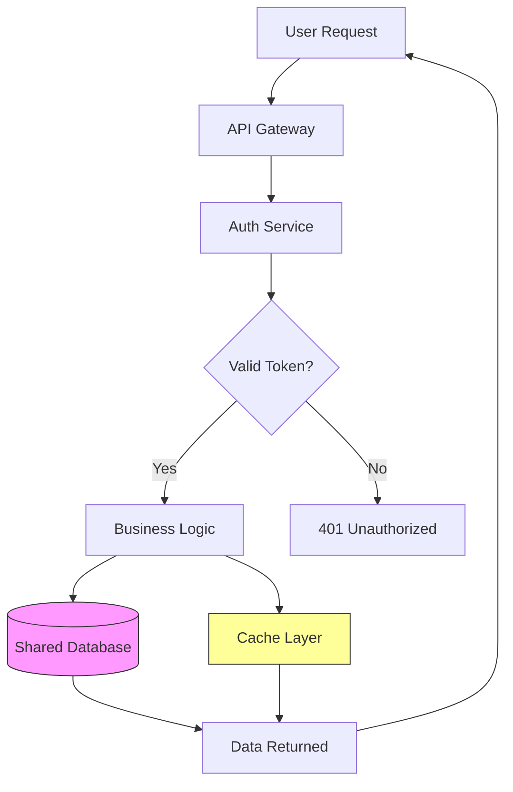

layout: default
title: "incident-response.sh - Simple incident escalation script"
description: "A practical guide for platform engineers working remotely to manage shared infrastructure services. Compare tools, see code examples, and implement"
date: 2026-03-16
last_modified_at: 2026-03-16
author: theluckystrike
permalink: /best-remote-collaboration-tool-for-platform-engineers-managing-shared-infrastructure-services/
categories: [guides]
tags: [remote-work-tools, platform-engineering, infrastructure, shared-services, remote-work, collaboration, best-of]
reviewed: true
score: 9
intent-checked: true
voice-checked: true---



Platform engineers managing shared infrastructure from a remote or distributed team need collaboration tools that handle both the async communication side and the technical coordination of shared services. The best setup combines an internal developer portal (IDP) for service discovery, structured incident response workflows, and documented runbooks that work across time zones. This guide covers practical tooling and patterns for each layer.

## Key Takeaways

- **Backstage is the most**: widely adopted open-source IDP.
- **The best setup combines**: an internal developer portal (IDP) for service discovery, structured incident response workflows, and documented runbooks that work across time zones.
- **How do you handle**: on-call handoff across time zones? Use a written handoff template posted in your incidents channel at the start of each shift.
- **Should platform documentation live**: in Confluence or GitHub? Prefer GitHub when your team already reviews infrastructure changes there.

## Internal Developer Portals for Service Discovery

When engineers across multiple time zones need to find who owns the Postgres cluster or how to use the internal API gateway, an internal developer portal eliminates the need to ping people directly.

Backstage is the most widely adopted open-source IDP. Register shared services using its catalog format:

```yaml
apiVersion: backstage.io/v1alpha1
kind: API
metadata:
  name: postgres-api
  description: Internal API for database access
spec:
  type: openapi
  lifecycle: production
  owner: platform-team
  definition:
    $openapi: ./openapi.yaml
```

Backstage's documentation feature lets you maintain runbooks, architecture diagrams, and operational procedures in a searchable format. When an on-call engineer in a different time zone needs to troubleshoot the API gateway, they find the documentation directly rather than pinging the platform team.

Two strong alternatives to Backstage are worth knowing: **Port** offers a no-code portal builder with Kubernetes and cloud integrations out of the box, making it faster to set up for smaller teams. **Cortex** focuses on service health scorecards and ownership visibility, which is useful when your platform team needs to hold application teams accountable to infrastructure standards. Backstage wins on extensibility and community plugins; Port wins on time-to-value; Cortex wins on service quality tracking.

## Incident Response Coordination

When infrastructure incidents occur in remote teams, coordination becomes critical. Use a structured approach that separates detection, response, and communication:

```bash
#!/bin/bash
# incident-response.sh - Simple incident escalation script

SEVERITY=$1
DESCRIPTION=$2
INCIDENT_ID=$(date +%Y%m%d%H%M%S)-$(openssl rand -hex 4)

echo "Creating incident: $INCIDENT_ID"
echo "Severity: $SEVERITY"
echo "Description: $DESCRIPTION"

# Create incident channel/thread
aws sns publish \
  --topic-arn "arn:aws:sns:us-east-1:123456789012:incidents" \
  --message "INCIDENT $INCIDENT_ID [$SEVERITY]: $DESCRIPTION" \
  --subject "New Incident: $INCIDENT_ID"

# Update status page
curl -X POST "https://status.example.com/api/incidents" \
  -H "Authorization: Bearer $STATUS_API_KEY" \
  -d "{\"title\":\"$DESCRIPTION\",\"severity\":\"$SEVERITY\",\"incident_id\":\"$INCIDENT_ID\"}"
```

For incident communication, establish a convention that everyone follows:

```markdown
## Incident Update Template

**Incident ID:** INC-2026-0315-001
**Current Status:** Investigating / Identified / Monitoring / Resolved
**Severity:** SEV1 / SEV2 / SEV3

### What Happened
[Brief description of the issue]

### Current Impact
[Which services/teams are affected]

### Next Steps
[What we are doing now]

### ETA for Resolution
[Estimated time or "unknown"]
```

For dedicated incident management tooling, **PagerDuty** and **Incident.io** are the two most used platforms. PagerDuty excels at on-call scheduling with complex rotation rules and deep alerting integrations. Incident.io focuses on the communication and coordination layer — it creates Slack channels automatically, tracks timeline updates, and generates post-mortem templates. For small platform teams (3-6 engineers), Incident.io's structured workflow reduces coordination overhead significantly. PagerDuty makes more sense when you have multiple on-call rotations and need granular escalation policies.

## Cross-Team Communication Channels

Platform teams need dedicated channels for different types of communication. Structure your communication tools to match the urgency and audience:

| Channel Type | Purpose | Expected Response Time |
|--------------|---------|------------------------|
| #infra-alerts | Production incidents | Immediate |
| #infra-changes | Pending deployments | Within 4 hours |
| #infra-questions | General questions | Within 24 hours |
| #infra-architecture | RFCs and design discussions | Within 48 hours |

Use Slack's workflow builder to create self-service request forms:

```json
{
  "workflow_name": "Infrastructure Request",
  "steps": [
    {
      "type": "form",
      "title": "Request Infrastructure Change",
      "fields": [
        {"name": "service", "label": "Affected Service"},
        {"name": "change_type", "label": "Change Type", "type": "select",
         "options": ["Configuration", "Capacity", "New Resource", "Decommission"]},
        {"name": "justification", "label": "Business Justification"},
        {"name": "timeline", "label": "Requested Timeline"}
      ]
    }
  ]
}
```

For teams that find Slack too noisy, **Linear** announcements and **Notion** databases work well for lower-urgency coordination. Linear's update feature lets you push infrastructure change notices to subscribers without requiring everyone to monitor a channel. A Notion change log with status columns gives downstream teams a single source of truth they can check on their own schedule.

## Documentation That Works Remotely

Effective remote collaboration requires documentation that answers questions before they get asked. Maintain these key documents for every shared service:

1. Runbooks: Step-by-step procedures for common operations (scale a service, rotate credentials, troubleshoot latency)
2. Architecture diagrams: Visual representation of how services connect
3. SLO definitions: Clear service level objectives that other teams can understand
4. Change logs: Historical record of what changed and when

Use Mermaid diagrams that stay in version control alongside your infrastructure code:



For documentation hosting, **Confluence** remains common in enterprise environments, but many platform teams are moving toward **Notion** or docs-as-code approaches with **MkDocs** deployed alongside their services. Docs-as-code wins when your team already lives in GitHub — engineers update runbooks in the same PR that changes the infrastructure, keeping documentation in sync.

## Change Management for Shared Services

Shared infrastructure changes carry higher risk than single-team deployments because they affect downstream teams who may not know a change is coming. Remote platform teams need a lightweight change management process that does not create bureaucratic overhead.

Use a weekly change calendar shared in a dedicated channel:

```markdown
## Infra Change Calendar — Week of 2026-03-17

### Monday
- 14:00 UTC: Postgres connection pool size increase (platform-team)

### Wednesday
- 10:00 UTC: Redis cluster node replacement (platform-team)

### Thursday
- Maintenance window: API gateway config update (platform-team)

### Friday
- No changes scheduled (pre-weekend freeze)
```

Announce changes 24 hours in advance for non-emergency changes. For same-day changes, notify affected service owners in their team channels, not just the infrastructure channel.

Tag your change announcements with affected services. Engineers subscribe to updates for services they depend on and ignore the rest, keeping the signal-to-noise ratio high.

For teams that want structured change management without heavyweight ITSM tooling, **LinearB** and **Cortex** both offer lightweight change tracking integrated with GitHub and deployment pipelines. These tools automatically capture what changed, who approved it, and what the deployment outcome was — reducing the manual overhead of maintaining a change log.

## Async Runbook Reviews

Runbooks go stale faster than code. A platform team of 3 engineers cannot manually review 50 runbooks quarterly. Automate staleness detection:

```yaml
# .github/workflows/runbook-freshness.yml
name: Runbook Freshness Check

on:
  schedule:
    - cron: '0 9 * * 1'  # Every Monday

jobs:
  check:
    runs-on: ubuntu-latest
    steps:
      - uses: actions/checkout@v4
      - name: Find stale runbooks
        run: |
          STALE_DAYS=90
          find docs/runbooks -name "*.md" -mtime +${STALE_DAYS} | while read f; do
            OWNER=$(grep "owner:" "$f" | head -1 | cut -d: -f2 | tr -d ' ')
            echo "Stale runbook: $f (owner: $OWNER)"
          done > stale-runbooks.txt
      - name: Post to Slack
        if: ${{ hashFiles('stale-runbooks.txt') != '' }}
        run: |
          cat stale-runbooks.txt | while read line; do
            curl -X POST $SLACK_WEBHOOK -d "{\"text\": \"$line needs review\"}"
          done
        env:
          SLACK_WEBHOOK: ${{ secrets.SLACK_WEBHOOK }}
```

This surfaces stale runbooks automatically without manual tracking. Owners get direct notifications rather than having the platform team act as intermediary.

## Choosing the Right Tool Stack

For most distributed platform teams, the highest-use combination is: Backstage (or Port) for service catalog, Incident.io for incident coordination, Slack with structured channels for async communication, and docs-as-code with MkDocs for runbooks. Add PagerDuty when your on-call rotation complexity demands it.

Start with the service catalog first. When engineers can answer "who owns this?" and "how do I use this?" without pinging anyone, the quality of all downstream coordination improves — fewer interruptions, cleaner incidents, and faster onboarding when someone new joins the team.

## Frequently Asked Questions

**What is the minimum viable toolset for a small platform team going remote?**
A service catalog (even a simple wiki page), a structured incident communication template shared in Slack, and documented runbooks in GitHub are enough to start. Add dedicated tooling as the team grows past 5-6 engineers.

**How do you handle on-call handoff across time zones?**
Use a written handoff template posted in your incidents channel at the start of each shift. Include active alerts, any ongoing investigations, and context on what was attempted. Incident.io has built-in handoff workflows; otherwise a Slack form or linear comment thread works.

**Should platform documentation live in Confluence or GitHub?**
Prefer GitHub when your team already reviews infrastructure changes there. Co-locating runbooks with infrastructure code means documentation updates are reviewable in PRs and stay in sync with actual system state.

## Related Articles

- [Scale Remote Team Incident Response From Startup to Mid-Size](/remote-work-tools/how-to-scale-remote-team-incident-response-process-from-star/)
- [How to Scale Remote Team Incident Response Process From](/remote-work-tools/how-to-scale-remote-team-incident-response-process-from-startup-to-mid-size-company/)
- [From your local machine with VPN active](/remote-work-tools/remote-team-runbook-creation-guide-for-incident-response-wit/)
- [Remote Team Security Incident Response Plan Template for](/remote-work-tools/remote-team-security-incident-response-plan-template-for-distributed-organizations-guide/)
- [Example: Simple calendar reminder script for kit deployment](/remote-work-tools/best-activity-kit-subscription-for-kids-of-remote-working-pa/)

Built by theluckystrike — More at [zovo.one](https://zovo.one)

