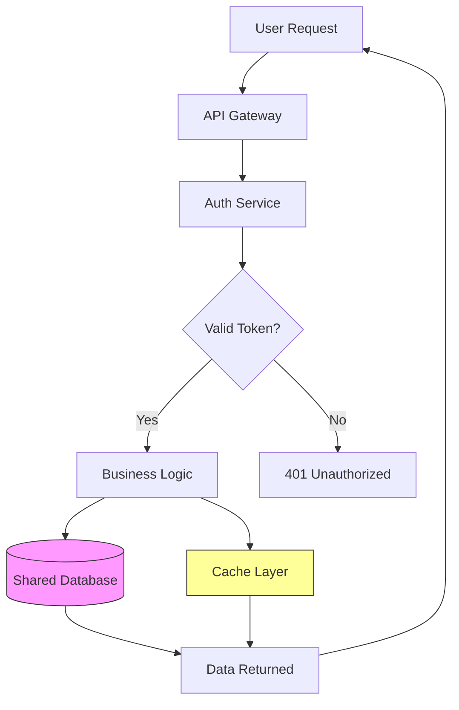

apiVersion: backstage.io/v1alpha1
kind: API
metadata:
  name: postgres-api
  description: Internal API for database access
spec:
  type: openapi
  lifecycle: production
  owner: platform-team
  definition:
    $openapi: ./openapi.yaml
```

Backstage's documentation feature lets you maintain runbooks, architecture diagrams, and operational procedures in a searchable format. When an on-call engineer in a different time zone needs to troubleshoot the API gateway, they find the documentation directly rather than pinging the platform team.

## Incident Response Coordination

When infrastructure incidents occur in remote teams, coordination becomes critical. Use a structured approach that separates detection, response, and communication:

```bash
#!/bin/bash
# incident-response.sh - Simple incident escalation script

SEVERITY=$1
DESCRIPTION=$2
INCIDENT_ID=$(date +%Y%m%d%H%M%S)-$(openssl rand -hex 4)

echo "Creating incident: $INCIDENT_ID"
echo "Severity: $SEVERITY"
echo "Description: $DESCRIPTION"

# Create incident channel/thread
aws sns publish \
  --topic-arn "arn:aws:sns:us-east-1:123456789012:incidents" \
  --message "INCIDENT $INCIDENT_ID [$SEVERITY]: $DESCRIPTION" \
  --subject "New Incident: $INCIDENT_ID"

# Update status page
curl -X POST "https://status.example.com/api/incidents" \
  -H "Authorization: Bearer $STATUS_API_KEY" \
  -d "{\"title\":\"$DESCRIPTION\",\"severity\":\"$SEVERITY\",\"incident_id\":\"$INCIDENT_ID\"}"
```

For incident communication, establish a convention that everyone follows:

```markdown
## Incident Update Template

**Incident ID:** INC-2026-0315-001
**Current Status:** Investigating / Identified / Monitoring / Resolved
**Severity:** SEV1 / SEV2 / SEV3

### What Happened
[Brief description of the issue]

### Current Impact
[Which services/teams are affected]

### Next Steps
[What we are doing now]

### ETA for Resolution
[Estimated time or "unknown"]
```

## Cross-Team Communication Channels

Platform teams need dedicated channels for different types of communication. Structure your communication tools to match the urgency and audience:

| Channel Type | Purpose | Expected Response Time |
|--------------|---------|------------------------|
| #infra-alerts | Production incidents | Immediate |
| #infra-changes | Pending deployments | Within 4 hours |
| #infra-questions | General questions | Within 24 hours |
| #infra-architecture | RFCs and design discussions | Within 48 hours |

Use Slack's workflow builder to create self-service request forms:

```json
{
  "workflow_name": "Infrastructure Request",
  "steps": [
    {
      "type": "form",
      "title": "Request Infrastructure Change",
      "fields": [
        {"name": "service", "label": "Affected Service"},
        {"name": "change_type", "label": "Change Type", "type": "select", 
         "options": ["Configuration", "Capacity", "New Resource", "Decommission"]},
        {"name": "justification", "label": "Business Justification"},
        {"name": "timeline", "label": "Requested Timeline"}
      ]
    }
  ]
}
```

## Documentation That Works Remotely

Effective remote collaboration requires documentation that answers questions before they get asked. Maintain these key documents for every shared service:

1. Runbooks: Step-by-step procedures for common operations (scale a service, rotate credentials, troubleshoot latency)
2. Architecture diagrams: Visual representation of how services connect
3. SLO definitions: Clear service level objectives that other teams can understand
4. Change logs: Historical record of what changed and when

Use Mermaid diagrams that stay in version control alongside your infrastructure code:



## Related Reading

- [Remote Work Guides Hub](/remote-work-tools/guides-hub/)
- [Remote Engineering Team Infrastructure Cost Per Deploy.](/remote-work-tools/remote-engineering-team-infrastructure-cost-per-deploy-track/)
- [Remote Content Team Collaboration Workflow for.](/remote-work-tools/remote-content-team-collaboration-workflow-for-distributed-seo-writers-2026-guide/)
- [Remote Developer Documentation Collaboration Tools for.](/remote-work-tools/remote-developer-documentation-collaboration-tools-for-maint/)

Built by

Built by theluckystrike — More at [zovo.one](https://zovo.one)
