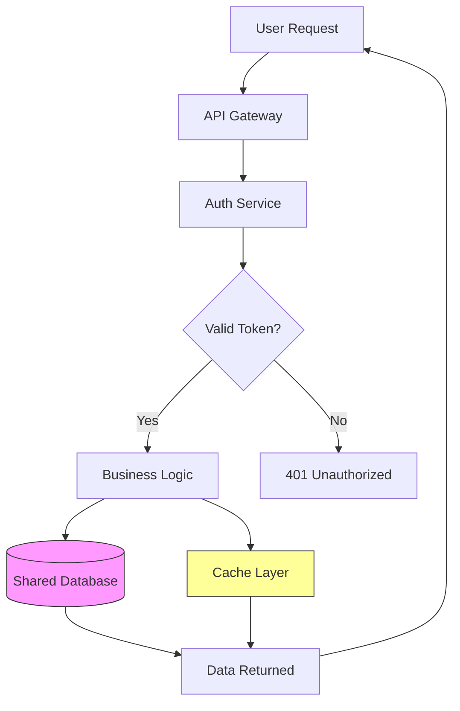


# Best Remote Collaboration Tool for Platform Engineers Managing Shared Infrastructure Services

Choose GitHub Projects if your platform engineering team already uses GitHub, or Backstage if you need a service catalog that scales across multiple infrastructure teams. For platform engineers managing shared infrastructure services remotely, your team's work affects every other engineering group, which means coordination must be exceptionally clear across time zones. This guide evaluates practical collaboration tools and implementation approaches—GitHub Projects for small teams, Backstage for service catalogs, and incident response coordination—with code examples you can apply immediately.

## The Remote Platform Engineering Challenge

When you manage shared infrastructure services—Kubernetes clusters, CI/CD pipelines, databases, API gateways, or service meshes—your team becomes the backbone of every other team's productivity. In a remote environment, you lose the ability to walk over to someone else's desk and explain a pending change or debug an issue together.

The best collaboration approaches for remote platform engineering share these characteristics: they provide asynchronous visibility into infrastructure changes, maintain clear ownership boundaries, support incident response coordination, and keep documentation discoverable without requiring real-time availability. Here is how to evaluate your options and implement effective workflows.

## GitHub Projects with Infrastructure Automation

For teams already using GitHub, combining Projects with infrastructure-as-code workflows provides a solid foundation for remote collaboration. Create a dedicated project board for infrastructure changes that maps directly to your deployment process:

```yaml
# .github/infrastructure-board.yml
name: Infrastructure Changes
columns:
  - name: Proposed
    description: Changes awaiting review
  - name: In Progress
    description: Currently being implemented
  - name: Review
    description: Awaiting approval
  - name: Deployed
    description: Live in production
```

Link every infrastructure change— Terraform modifications, Kubernetes manifest updates, or Ansible playbook changes—to a project card. This creates an auditable trail that remote team members can review asynchronously. When someone in Tokyo needs to understand what changes are pending for the database cluster, they check the board instead of asking in Slack.

Use GitHub issue templates specifically for infrastructure requests:

```yaml
# .github/ISSUE_TEMPLATE/infrastructure-change.md
---
name: Infrastructure Change Request
about: Request changes to shared infrastructure
title: "[INFRA] "
labels: infrastructure
assignees: ''

## Change Description
What needs to change and why?

## Impact Assessment
- [ ] No impact - internal change only
- [ ] Low impact - some teams may experience minor disruption
- [ ] High impact - requires coordinated rollout

## Rollback Plan
How do we revert if this causes issues?

## Communication Plan
Who needs to be notified before/after deployment?
```

## Backstage for Service Catalogs

For larger organizations running multiple shared services, Backstage provides a platform for service ownership and documentation. It works particularly well for remote teams because it serves as a single source of truth that everyone can access without needing to ask questions.

Create a standardized template for your infrastructure services:

```yaml
# catalog-info.yaml for a shared service
apiVersion: backstage.io/v1alpha1
kind: Component
metadata:
  name: shared-database-service
  description: Managed PostgreSQL cluster for team workloads
  tags: [postgresql, database, shared-service]
spec:
  type: service
  lifecycle: production
  owner: platform-team
  providesApis:
    - postgres-api
---
apiVersion: backstage.io/v1alpha1
kind: API
metadata:
  name: postgres-api
  description: Internal API for database access
spec:
  type: openapi
  lifecycle: production
  owner: platform-team
  definition:
    $openapi: ./openapi.yaml
```

Backstage's documentation feature lets you maintain runbooks, architecture diagrams, and operational procedures in a searchable format. When an on-call engineer in a different time zone needs to troubleshoot the API gateway, they find the documentation directly rather than pinging the platform team.

## Incident Response Coordination

When infrastructure incidents occur in remote teams, coordination becomes critical. Use a structured approach that separates detection, response, and communication:

```bash
#!/bin/bash
# incident-response.sh - Simple incident escalation script

SEVERITY=$1
DESCRIPTION=$2
INCIDENT_ID=$(date +%Y%m%d%H%M%S)-$(openssl rand -hex 4)

echo "Creating incident: $INCIDENT_ID"
echo "Severity: $SEVERITY"
echo "Description: $DESCRIPTION"

# Create incident channel/thread
aws sns publish \
  --topic-arn "arn:aws:sns:us-east-1:123456789012:incidents" \
  --message "INCIDENT $INCIDENT_ID [$SEVERITY]: $DESCRIPTION" \
  --subject "New Incident: $INCIDENT_ID"

# Update status page
curl -X POST "https://status.example.com/api/incidents" \
  -H "Authorization: Bearer $STATUS_API_KEY" \
  -d "{\"title\":\"$DESCRIPTION\",\"severity\":\"$SEVERITY\",\"incident_id\":\"$INCIDENT_ID\"}"
```

For incident communication, establish a convention that everyone follows:

```markdown
## Incident Update Template

**Incident ID:** INC-2026-0315-001
**Current Status:** Investigating / Identified / Monitoring / Resolved
**Severity:** SEV1 / SEV2 / SEV3

### What Happened
[Brief description of the issue]

### Current Impact
[Which services/teams are affected]

### Next Steps
[What we are doing now]

### ETA for Resolution
[Estimated time or "unknown"]
```

## Cross-Team Communication Channels

Platform teams need dedicated channels for different types of communication. Structure your communication tools to match the urgency and audience:

| Channel Type | Purpose | Expected Response Time |
|--------------|---------|------------------------|
| #infra-alerts | Production incidents | Immediate |
| #infra-changes | Pending deployments | Within 4 hours |
| #infra-questions | General questions | Within 24 hours |
| #infra-architecture | RFCs and design discussions | Within 48 hours |

Use Slack's workflow builder to create self-service request forms:

```json
{
  "workflow_name": "Infrastructure Request",
  "steps": [
    {
      "type": "form",
      "title": "Request Infrastructure Change",
      "fields": [
        {"name": "service", "label": "Affected Service"},
        {"name": "change_type", "label": "Change Type", "type": "select", 
         "options": ["Configuration", "Capacity", "New Resource", "Decommission"]},
        {"name": "justification", "label": "Business Justification"},
        {"name": "timeline", "label": "Requested Timeline"}
      ]
    }
  ]
}
```

## Documentation That Works Remotely

Effective remote collaboration requires documentation that answers questions before they get asked. Maintain these key documents for every shared service:

1. Runbooks: Step-by-step procedures for common operations (scale a service, rotate credentials, troubleshoot latency)
2. Architecture diagrams: Visual representation of how services connect
3. SLO definitions: Clear service level objectives that other teams can understand
4. Change logs: Historical record of what changed and when

Use Mermaid diagrams that stay in version control alongside your infrastructure code:



## Related Reading

- [Remote Work Guides Hub](/remote-work-tools/guides-hub/)
- [Remote Engineering Team Infrastructure Cost Per Deploy.](/remote-work-tools/remote-engineering-team-infrastructure-cost-per-deploy-track/)
- [Remote Content Team Collaboration Workflow for.](/remote-work-tools/remote-content-team-collaboration-workflow-for-distributed-seo-writers-2026-guide/)
- [Remote Developer Documentation Collaboration Tools for.](/remote-work-tools/remote-developer-documentation-collaboration-tools-for-maint/)

Built by

Built by theluckystrike — More at [zovo.one](https://zovo.one)
