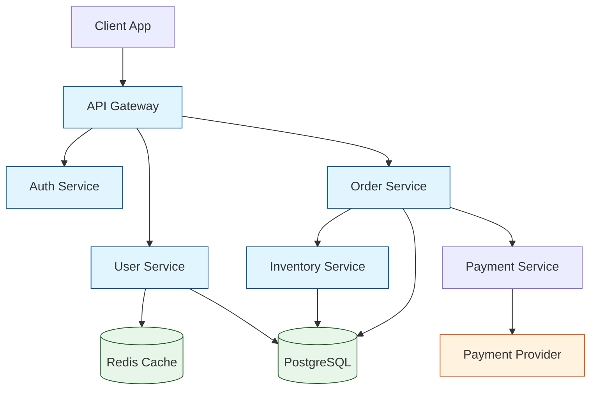


# Best Remote Collaboration Tool for Technical Architects Documenting System Dependencies Guide

Document system dependencies using GitHub's native dependency graph plus custom markdown in your repo for service relationships, create visual architecture diagrams in Miro or Lucidchart, and maintain a living README that evolves with your system. This guide shows you how to keep dependency documentation async-friendly and accessible without requiring synchronous documentation meetings.

## The Remote Architecture Documentation Challenge

When your team works across time zones, you lose the informal knowledge transfer that happens in physical offices. A senior engineer understands the payment service depends on the billing API and notification webhooks, but that knowledge stays in their head until someone asks. Documenting dependencies formally becomes essential, but traditional tools often fall short for distributed teams.

The best dependency documentation tools for remote technical architects share specific characteristics: they integrate with existing workflows, support asynchronous review, maintain version history, and remain accessible to everyone without requiring special software. Here is how to evaluate your options.

## GitHub Dependency Graph and Dependency Review

For teams using GitHub, the native dependency graph provides a solid starting point for understanding third-party library dependencies. Enable it in your repository settings:

```yaml
# .github/dependabot.yml
version: 2
updates:
  - package-ecosystem: "npm"
    directory: "/"
    schedule:
      interval: "weekly"
  - package-ecosystem: "pip"
    directory: "/"
    schedule:
      interval: "weekly"
```

The dependency graph visualizes direct and transitive dependencies, highlighting known vulnerabilities. However, it focuses on package dependencies rather than service-level dependencies between your own microservices.

For service-level dependency tracking, create a dedicated dependency manifest in your repository:

```yaml
# docs/system-dependencies.yaml
services:
  - name: user-service
    type: internal
    depends_on:
      - database: postgres-main
      - cache: redis-cluster
      - service: auth-service
    endpoints:
      - /api/v1/users
      - /api/v1/users/{id}

  - name: auth-service
    type: internal
    depends_on:
      - database: postgres-main
      - cache: redis-sessions
      - external: oauth-provider
```

This YAML format is readable across your team and integrates with documentation generators.

## Mermaid.js for Dependency Visualization

Mermaid.js offers an excellent solution for teams that want visual dependency diagrams alongside their documentation. The tool renders diagrams from text definitions, making it easy to version control alongside your code.

Create a dependency diagram in any markdown file:



This diagram lives in your documentation repository. Remote team members can view rendered versions in GitHub's native Mermaid support or use local preview tools.

To generate dependency diagrams automatically from your code, write a script that parses service definitions:

```python
#!/usr/bin/env python3
"""Generate Mermaid diagram from service definitions."""
import yaml

def generate_mermaid(services):
    lines = ["graph TD"]
    for svc in services:
        name = svc['name']
        lines.append(f"    {name}[{name}]")
        for dep in svc.get('depends_on', []):
            if isinstance(dep, dict):
                for dep_type, dep_name in dep.items():
                    if dep_type == 'service':
                        lines.append(f"    {name} --> {dep_name}")
            else:
                lines.append(f"    {name} --> {dep}")
    
    lines.append("")
    lines.append("    classDef internal fill:#e1f5fe,stroke:#01579b")
    lines.append("    class " + ",".join(s['name'] for s in services) + " internal")
    
    return "\n".join(lines)

# Example usage
with open('docs/system-dependencies.yaml') as f:
    services = yaml.safe_load(f)['services']

print(generate_mermaid(services))
```

Running this script automatically generates an updated diagram when your dependency definitions change.

## Backstage for Service Catalogs

Backstage, originally developed at Spotify and now a CNCF project, provides a platform for managing service catalogs. It works particularly well for larger organizations with multiple teams needing to understand system relationships.

Install the Backstage software template to standardize how teams document services:

```bash
# Initialize Backstage
npx @backstage/cli@latest init

# Create a component template
cat > template.yaml << 'EOF'
apiVersion: backstage.io/v1beta2
kind: Template
metadata:
  name: service-template
  description: Create a new microservice
spec:
  owner: platform-team
  type: service
  
  steps:
    - id: fetch-base
      action: fetch:cookiecutter
      input:
        url: https://github.com/your-org/service-template
        values:
          name: ${{ parameters.name }}
          description: ${{ parameters.description }}
          
    - id: publish
      action: catalog:register
      input:
        entityRef: ${{ steps.fetch-base.output.entityRef }}
```

Backstage's service catalog captures not just dependencies but also ownership, APIs, documentation links, and runbook locations. The platform integrates with GitHub, providing a centralized hub where remote team members discover how services connect without asking in chat.

The primary drawback: Backstage requires significant infrastructure to deploy and maintain. Smaller teams may find the overhead excessive compared to simpler alternatives.

## Dependency Track for Security and License Compliance

Dependency Track takes a different approach, focusing on tracking dependencies across your entire software portfolio. It integrates with CI/CD pipelines to continuously monitor for vulnerabilities and license compliance issues.

Configure Dependency Track monitoring in your pipeline:

```yaml
# .github/workflows/dependency-track.yml
name: Dependency Track Analysis
on:
  push:
    branches: [main]
  schedule:
    - cron: '0 6 * * *'  # Daily at 6 AM UTC

jobs:
  analyze:
    runs-on: ubuntu-latest
    steps:
      - uses: actions/checkout@v4
      
      - name: Build dependency manifest
        run: |
          npm install --package-lock-only
          
      - name: Upload to Dependency Track
        uses: cyclonedx/cyclonedx-npm@v1
        with:
          output-file: bom.xml
          
      - name: Submit BOM
        run: |
          curl -X POST \
            -u ${{ secrets.DT_API_KEY }}: \
            -H "Content-Type: application/xml" \
            --data-binary @bom.xml \
            https://dependencytrack.example.com/api/v1/bom
```

This workflow generates a Software Bill of Materials (SBOM) and submits it for analysis. Your team receives alerts when new vulnerabilities affect your dependencies.

## Choosing Your Documentation Approach

Select tools based on team size, existing infrastructure, and documentation needs:

| Approach | Best For | Drawback |
|----------|----------|----------|
| GitHub native | Teams already in GitHub | Limited service-level view |
| Mermaid.js | Visual teams wanting version control | Manual diagram updates |
| Backstage | Large organizations | Infrastructure overhead |
| Dependency Track | Security-focused teams | Doesn't show architecture |

Most successful remote teams combine approaches. Use Mermaid for architecture diagrams stored alongside code, Dependency Track for security monitoring, and a service catalog like Backstage when your portfolio grows beyond a handful of services.

## Implementing Remote-Friendly Documentation Workflows

Regardless of tool choice, establish processes that work across time zones:

1. Treat dependencies as code: Store dependency definitions in version control, require PR reviews for changes, and automate diagram generation where possible.

2. Link from code to documentation: Add comments in your service code that reference dependency documentation:

```python
# user_service.py
# Dependencies: See docs/architecture/system-dependencies.yaml
# Related ADRs: docs/adr/004-user-service-architecture.md
class UserService:
    """Handles user management and authentication.
    
    Depends on:
    - auth-service for token validation
    - redis-cluster for session caching
    - postgres-main for persistent storage
    """
```

3. Review in async PRs: When teams modify dependencies, use pull requests for review. Team members across time zones can comment before changes merge.

4. Automate stale detection: Write scripts that flag dependencies without recent updates or missing owners:

```bash
#!/bin/bash
# Check for undocumented dependencies
for service in services/*/; do
    doc_file="docs/dependencies/$(basename $service).md"
    if [ ! -f "$doc_file" ]; then
        echo "Missing dependency doc: $service"
    fi
done
```

## Related Reading

- [Remote Work Guides Hub](/remote-work-tools/guides-hub/)

Built by theluckystrike — More at [zovo.one](https://zovo.one)

