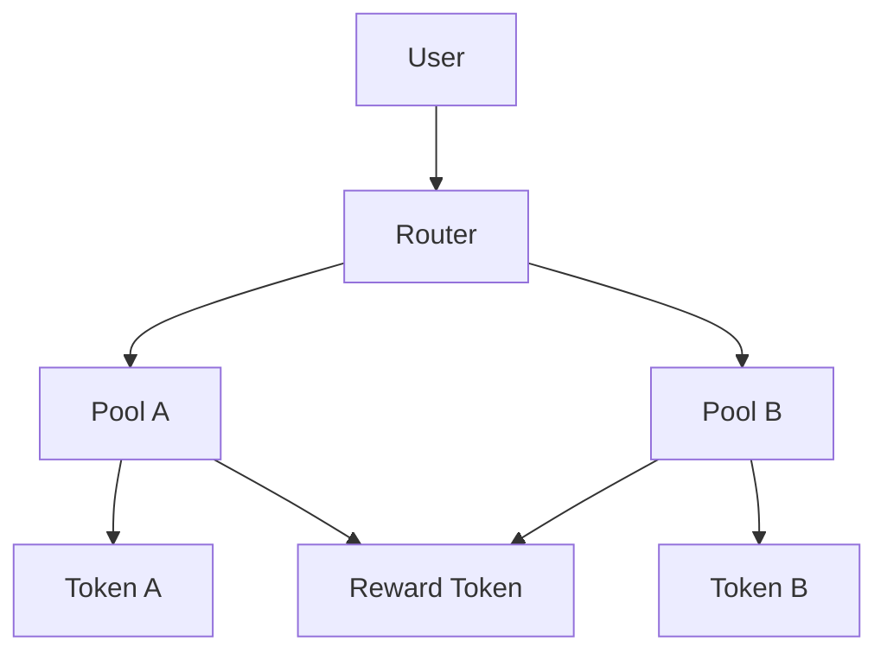



Remote Solidity development teams face unique challenges when coordinating smart contract audits.分散在多个时区的开发者需要高效的沟通渠道、结构化的代码审查流程，以及能够跟踪审计进度的项目管理工具。本文介绍帮助远程Solidity团队协调智能合约审计的实际工具。

## Communication and Synchronization Tools

### Discord with Threaded Channels

Discord remains the preferred communication platform for remote blockchain teams. Create dedicated channels for different audit phases:

```
#audit-kickoff      - Initial scope discussion
#code-reviews       - Pull request discussions  
#findings           - Security vulnerability reports
#verification       - Fix verification and retesting
```

Use thread functionality to keep discussions organized. Each finding gets its own thread, preventing important information from getting lost in channel noise.

### Zoom with Code Sharing

For complex technical discussions, Zoom's screen sharing with code highlighting proves essential. Record all audit sync meetings for async team members in different time zones. Configure local recording by default—remote auditors in Asia or Europe will appreciate the option to review discussions later.

## Code Collaboration and Review

### GitHub/GitLab Pull Request Workflow

Structured pull request templates improve audit efficiency. A typical template for audit-related PRs:

```markdown
## Contract Scope
- [ ] `contracts/Token.sol`
- [ ] `contracts/Staking.sol`

## Audit Phase
- [ ] Initial review complete
- [ ] Findings documented
- [ ] Fix implemented
- [ ] Verification testing passed

## Security Considerations
<!-- List any security-relevant changes -->

## Test Coverage
<!-- Reference to test files covering changes -->
```

Enforce CODEOWNERS files to ensure senior auditors review critical contracts automatically.

### Tenderly for Transaction Simulation

Tenderly provides transaction simulation and debugging essential for audit workflows. Remote teams can share simulation links rather than recreating scenarios:

```javascript
// Example: Tenderly simulation URL format
const simulationUrl = `https://dashboard.tenderly.co/shared/simulation/${simulationId}`;
```

This enables auditors to examine exact gas consumption, state changes, and reverts without deploying to testnets.

## Project Management for Audit Workflows

### Linear for Finding Tracking

Linear integrates well with GitHub and provides structured issue tracking specifically designed for technical teams. Create custom fields for:

- **Severity**: Critical, High, Medium, Low, Informational
- **Status**: Triaged, In Progress, Verified, Closed
- **Contract**: Token, Vault, Oracle, etc.
- **Finding Type**: Reentrancy, Access Control, Integer Overflow, etc.

Sync Linear issues with GitHub PRs to maintain audit trail continuity.

### Notion for Audit Documentation

Maintain a centralized Notion workspace with:

- Audit scope and timeline documents
- Finding databases with severity排序
- Remediation checklists
- Team capacity planning

Export Notion pages as PDF reports for audit deliverables to clients.

## Testing and Security Analysis Tools

### Foundry for Smart Contract Testing

Foundry provides the fastest testing framework for Solidity audits. Its forge test command runs unit tests with excellent reporting:

```bash
# Run all tests with verbosity
forge test -vvvv

# Run tests matching a pattern
forge test --match-test testReentrancy

# Generate gas reports
forge test --gas-report
```

Foundry's fuzz testing capabilities help discover edge cases that manual review might miss.

### Slither for Static Analysis

Trail of Bits' Slither runs static analysis on Solidity code automatically. Integrate it into CI pipelines:

```bash
# Basic analysis
slither . --json results.json

# Run specific detectors
slither . --detect reentrancy-eth,unchecked-lowlevel

# Check for upgradeable proxy issues
slither . --detect proxy-lib
```

Generate slither JSON output and import findings directly into your tracking system.

### Mythril for Symbolic Execution

Mythril performs symbolic execution to discover complex vulnerabilities:

```bash
# Analyze a contract
myth analyze contracts/Token.sol

# Output to JSON
myth analyze contracts/Token.sol --output analysis.json
```

Use Mythril alongside Slither—each tool catches different vulnerability classes.

## Documentation and Reporting

### Mermaid for Audit Flowcharts

Include architecture diagrams in audit reports using Mermaid syntax:



### Shrinkwrap or Docusaurus for Audit Reports

Generate professional audit reports using Docusaurus or Shrinkwrap. Include searchable finding databases, remediation instructions, and executive summaries.

## Practical Workflow Example

A remote team conducting a smart contract audit typically follows this sequence:

1. **Kickoff**: Discord sync meeting, Notion scope document creation
2. **Initial Review**: GitHub PRs for each contract, Slither/Mythril automated scans
3. **Manual Analysis**: Code review in VS Code with GitHub Copilot assistance
4. **Finding Documentation**: Linear issues with detailed reproduction steps
5. **Fix Verification**: Foundry tests confirm remediations, Tenderly simulations validate
6. **Report Generation**: Docusaurus export to PDF

This workflow keeps all team members aligned regardless of location.

## Setting Up Your Audit Tool Workflow

A complete audit workflow integrates multiple tools. Here's a practical setup for a remote team conducting a smart contract security audit:

```bash
#!/bin/bash
# audit-setup.sh - Initialize audit environment

# 1. Create project structure
mkdir -p contracts tests analysis

# 2. Initialize Foundry
forge init --no-git

# 3. Configure Slither for CI
cat > .github/workflows/security-scan.yml << 'EOF'
name: Security Scan
on: [push, pull_request]
jobs:
  slither:
    runs-on: ubuntu-latest
    steps:
      - uses: actions/checkout@v3
      - name: Run Slither
        uses: crytic/slither-action@v0.1.1
        with:
          node-version: 16
          fail-on: medium
          solc-version: 0.8.20
EOF

# 4. Set up Foundry gas analysis
forge test --gas-report > gas-report.txt
```

## Communication and Collaboration Patterns

For remote Solidity teams, establish clear communication patterns:

**Synchronous time blocks:** Reserve 30-minute sync windows for urgent findings and complex discussions. Keep these to 2-3 per week maximum to preserve async work.

**Async code review process:**
- Each reviewer leaves detailed comments on GitHub
- Comments reference specific lines and potential impacts
- Author responds within 24 hours (respect time zones)
- Updates code and requests re-review when ready

**Finding escalation path:**
- Critical severity: Immediate Slack ping + documented follow-up
- High severity: Discord thread with 24-hour response SLA
- Medium/Low: GitHub issue with weekly batch review

## Price Comparison of Audit Tools

| Tool | Purpose | Free Tier | Paid | Notes |
|------|---------|-----------|------|-------|
| Foundry | Testing | Yes | N/A | Fastest Solidity testing |
| Slither | Static analysis | Yes | No | Trail of Bits tool |
| Mythril | Symbolic execution | Yes | No | Ethereum Foundation |
| Tenderly | Debugging | Free tier | $99+/mo | Full transaction replay |
| Miro/FigJam | Diagrams | Free tier | $12+/mo | For architecture visualization |
| Linear | Issue tracking | Free tier | $7+/user/mo | GitHub integration essential |
| Notion | Documentation | Free tier | $10/mo | Team collaboration |
| Discord | Communication | Free | Optional | Team chat standard |

## Building Your Audit Checklist

Create an audit checklist that teams use for every smart contract review:

```markdown
# Smart Contract Audit Checklist

## Code Quality Review
- [ ] All functions have visible access specifiers
- [ ] State variables are properly scoped (public/private)
- [ ] Constants defined for magic numbers
- [ ] Functions under 100 lines
- [ ] Comments explain non-obvious logic

## Security Review
- [ ] Input validation on all external calls
- [ ] Reentrancy patterns identified and mitigated
- [ ] Integer overflow/underflow checked (use SafeMath if Solidity < 0.8)
- [ ] Access control verified for sensitive functions
- [ ] External call order respects checks-effects-interactions

## Testing Coverage
- [ ] Unit tests for all major functions
- [ ] Edge case tests for boundary conditions
- [ ] Fuzz tests for integer operations
- [ ] Integration tests for complex flows
- [ ] Minimum 85% code coverage

## Documentation
- [ ] natspec comments for all public functions
- [ ] Architecture documentation updated
- [ ] Known limitations documented
- [ ] Emergency procedures documented

## Deployment Readiness
- [ ] Staging environment tested
- [ ] Gas optimization completed
- [ ] Deployment scripts tested on testnet
- [ ] Upgrade path documented if upgradeable
```

## Tool Selection Considerations

When selecting tools for remote Solidity audit teams, prioritize:

- **Async-friendly**: Tools supporting asynchronous work across time zones
- **Integration**: GitHub/Linear/Discord integrations reduce context switching
- **Automation**: CI pipeline integration for Slither, Forge tests
- **Security**: Two-factor authentication, access controls for sensitive findings
- **Performance**: Tools that complete quickly (Foundry is 100x faster than hardhat)

Most teams end up using 5-7 core tools rather than every available option. Start with essential tools (GitHub, Discord, Foundry, Slither) and add more as team size grows and specialization increases.

## Training and Onboarding

For new team members joining the audit practice:

1. **Day 1:** Complete Slither and Mythril training with one known-vulnerable contract
2. **Day 2:** Shadow a live code review and understand GitHub workflow
3. **Day 3:** Conduct independent static analysis on existing contracts
4. **Day 4:** Pair with senior auditor on medium-severity findings
5. **Day 5:** Own one contract review end-to-end with mentorship

Document each step so team members can onboard themselves asynchronously.

---


## Frequently Asked Questions


**Are free AI tools good enough for tools for remote solidity teams coordinating smart?**

Free tiers work for basic tasks and evaluation, but paid plans typically offer higher rate limits, better models, and features needed for professional work. Start with free options to find what works for your workflow, then upgrade when you hit limitations.


**How do I evaluate which tool fits my workflow?**

Run a practical test: take a real task from your daily work and try it with 2-3 tools. Compare output quality, speed, and how naturally each tool fits your process. A week-long trial with actual work gives better signal than feature comparison charts.


**Do these tools work offline?**

Most AI-powered tools require an internet connection since they run models on remote servers. A few offer local model options with reduced capability. If offline access matters to you, check each tool's documentation for local or self-hosted options.


**Can I use these tools with a distributed team across time zones?**

Most modern tools support asynchronous workflows that work well across time zones. Look for features like async messaging, recorded updates, and timezone-aware scheduling. The best choice depends on your team's specific communication patterns and size.


**Should I switch tools if something better comes out?**

Switching costs are real: learning curves, workflow disruption, and data migration all take time. Only switch if the new tool solves a specific pain point you experience regularly. Marginal improvements rarely justify the transition overhead.


## Related Articles

- [Best Mobile Presentation Remote App for Remote Speakers: Controlling Slides from Your Phone](/best-mobile-presentation-remote-app-for-remote-speakers-cont/)
- [Best Smart Lighting for Home Office Developers](/best-smart-lighting-for-home-office-developers/)
- [Best Tools for Remote React Native Teams Coordinating iOS](/best-tools-for-remote-react-native-teams-coordinating-ios-an/)

Built by theluckystrike — More at [zovo.one](https://zovo.one)

