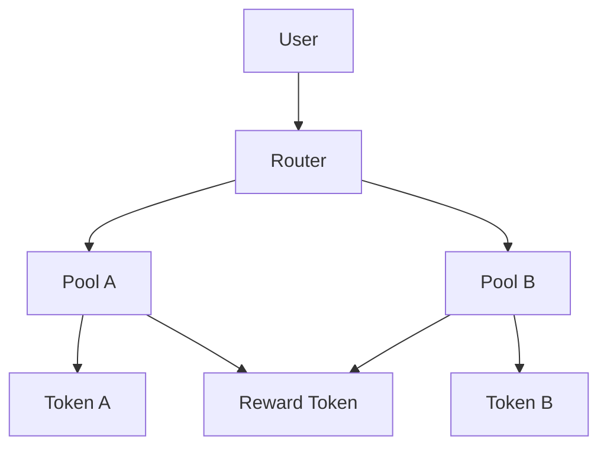


# Best Tools for Remote Solidity Teams Coordinating Smart Contract Audits 2026

Remote Solidity development teams face unique challenges when coordinating smart contract audits.分散在多个时区的开发者需要高效的沟通渠道、结构化的代码审查流程，以及能够跟踪审计进度的项目管理工具。本文介绍帮助远程Solidity团队协调智能合约审计的实际工具。

## Communication and Synchronization Tools

### Discord with Threaded Channels

Discord remains the preferred communication platform for remote blockchain teams. Create dedicated channels for different audit phases:

```
#audit-kickoff      - Initial scope discussion
#code-reviews       - Pull request discussions  
#findings           - Security vulnerability reports
#verification       - Fix verification and retesting
```

Use thread functionality to keep discussions organized. Each finding gets its own thread, preventing important information from getting lost in channel noise.

### Zoom with Code Sharing

For complex technical discussions, Zoom's screen sharing with code highlighting proves essential. Record all audit sync meetings for async team members in different time zones. Configure local recording by default—remote auditors in Asia or Europe will appreciate the option to review discussions later.

## Code Collaboration and Review

### GitHub/GitLab Pull Request Workflow

Structured pull request templates improve audit efficiency. A typical template for audit-related PRs:

```markdown
## Contract Scope
- [ ] `contracts/Token.sol`
- [ ] `contracts/Staking.sol`

## Audit Phase
- [ ] Initial review complete
- [ ] Findings documented
- [ ] Fix implemented
- [ ] Verification testing passed

## Security Considerations
<!-- List any security-relevant changes -->

## Test Coverage
<!-- Reference to test files covering changes -->
```

Enforce CODEOWNERS files to ensure senior auditors review critical contracts automatically.

### Tenderly for Transaction Simulation

Tenderly provides transaction simulation and debugging essential for audit workflows. Remote teams can share simulation links rather than recreating scenarios:

```javascript
// Example: Tenderly simulation URL format
const simulationUrl = `https://dashboard.tenderly.co/shared/simulation/${simulationId}`;
```

This enables auditors to examine exact gas consumption, state changes, and reverts without deploying to testnets.

## Project Management for Audit Workflows

### Linear for Finding Tracking

Linear integrates well with GitHub and provides structured issue tracking specifically designed for technical teams. Create custom fields for:

- **Severity**: Critical, High, Medium, Low, Informational
- **Status**: Triaged, In Progress, Verified, Closed
- **Contract**: Token, Vault, Oracle, etc.
- **Finding Type**: Reentrancy, Access Control, Integer Overflow, etc.

Sync Linear issues with GitHub PRs to maintain audit trail continuity.

### Notion for Audit Documentation

Maintain a centralized Notion workspace with:

- Audit scope and timeline documents
- Finding databases with severity排序
- Remediation checklists
- Team capacity planning

Export Notion pages as PDF reports for audit deliverables to clients.

## Testing and Security Analysis Tools

### Foundry for Smart Contract Testing

Foundry provides the fastest testing framework for Solidity audits. Its forge test command runs unit tests with excellent reporting:

```bash
# Run all tests with verbosity
forge test -vvvv

# Run tests matching a pattern
forge test --match-test testReentrancy

# Generate gas reports
forge test --gas-report
```

Foundry's fuzz testing capabilities help discover edge cases that manual review might miss.

### Slither for Static Analysis

Trail of Bits' Slither runs static analysis on Solidity code automatically. Integrate it into CI pipelines:

```bash
# Basic analysis
slither . --json results.json

# Run specific detectors
slither . --detect reentrancy-eth,unchecked-lowlevel

# Check for upgradeable proxy issues
slither . --detect proxy-lib
```

Generate slither JSON output and import findings directly into your tracking system.

### Mythril for Symbolic Execution

Mythril performs symbolic execution to discover complex vulnerabilities:

```bash
# Analyze a contract
myth analyze contracts/Token.sol

# Output to JSON
myth analyze contracts/Token.sol --output analysis.json
```

Use Mythril alongside Slither—each tool catches different vulnerability classes.

## Documentation and Reporting

### Mermaid for Audit Flowcharts

Include architecture diagrams in audit reports using Mermaid syntax:



### Shrinkwrap or Docusaurus for Audit Reports

Generate professional audit reports using Docusaurus or Shrinkwrap. Include searchable finding databases, remediation instructions, and executive summaries.

## Practical Workflow Example

A remote team conducting a smart contract audit typically follows this sequence:

1. **Kickoff**: Discord sync meeting, Notion scope document creation
2. **Initial Review**: GitHub PRs for each contract, Slither/Mythril automated scans
3. **Manual Analysis**: Code review in VS Code with GitHub Copilot assistance
4. **Finding Documentation**: Linear issues with detailed reproduction steps
5. **Fix Verification**: Foundry tests confirm remediations, Tenderly simulations validate
6. **Report Generation**: Docusaurus export to PDF

This workflow keeps all team members aligned regardless of location.

## Tool Selection Considerations

When selecting tools for remote Solidity audit teams, prioritize:

- **Async-friendly**: Tools supporting asynchronous work across time zones
- **Integration**: GitHub/Linear/Discord integrations reduce context switching
- **Automation**: CI pipeline integration for Slither, Forge tests
- **Security**: Two-factor authentication, access controls for sensitive findings

Most teams end up using 5-7 core tools rather than every available option. Start with essential tools and add more as team size grows.

---

Built by theluckystrike — More at [zovo.one](https://zovo.one)

