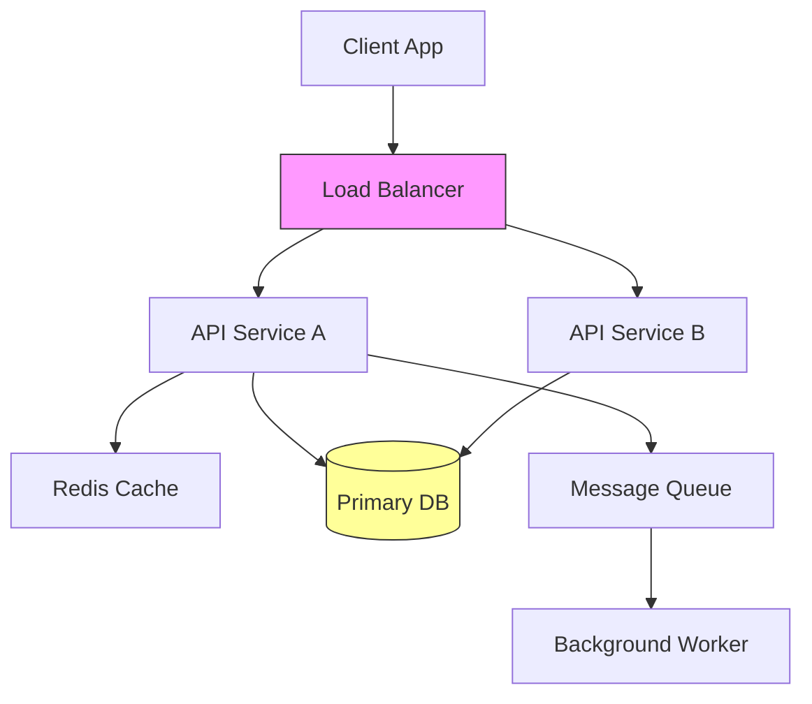
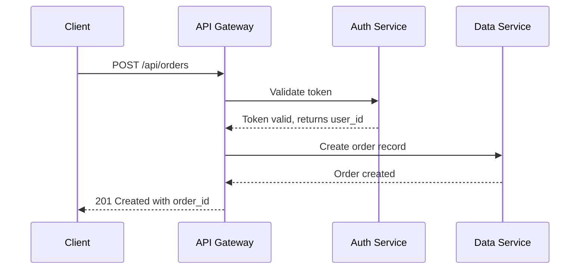


# Best Whiteboarding Tool for Remote Architects Doing System Design Sessions 2026

Remote system design sessions require whiteboarding tools that handle complex architecture diagrams, support real-time collaboration across time zones, and integrate with your existing workflow. After testing the leading options throughout 2025 and early 2026, here's a practical comparison for architects running distributed design sessions.

## What Remote Architects Need from Whiteboarding Tools

System design sessions differ from typical brainstorming. You need precise diagramming capabilities for:
- Component architecture diagrams
- Sequence diagrams showing data flow
- Entity-relationship diagrams for data modeling
- Infrastructure diagrams for cloud deployments
- API contract visualization

The tool must support both synchronous sessions with cursor tracking and asynchronous review for team members in different time zones.

## Excalidraw: The Developer-Favorite Choice

Excalidraw has become the go-to tool for remote architects who want hand-drawn-style diagrams with keyboard-driven workflows. It runs entirely in the browser with no account required for basic use.

### Key Features for System Design

Excalidraw supports custom components, which architects use to build reusable database icons, service boxes, and cloud provider symbols:

```javascript
// Excalidraw custom component definition
const dbIcon = {
  type: 'rectangle',
  width: 80,
  height: 60,
  strokeColor: '#000000',
  backgroundColor: '#ffffff',
  customData: {
    label: 'PostgreSQL',
    port: 5432
  }
};
```

Export diagrams as PNG, SVG, or JSON. The JSON export proves invaluable for version-controlling architecture diagrams in your repository.

### Collaboration Features

Create a session link and share it with team members. Everyone sees cursors in real-time, and the built-in chat allows async feedback without leaving the drawing. For GitHub-integrated teams, embed Excalidraw diagrams directly in issues and pull requests using the PNG export.

### Limitations

Excalidraw lacks native sequence diagram support. Architects typically draw these manually or use a separate tool like Mermaid.js for complex sequence flows.

## Miro: Enterprise-Grade Collaboration

Miro serves teams requiring enterprise features, templates, and integrations with tools like Jira, Confluence, and Slack. The platform handles complex system design sessions with its extensive shape library and template marketplace.

### Architecture Templates

Miro provides pre-built system design templates including:
- AWS architecture diagrams
- Microservices patterns
- C4 model templates
- Database schema templates

Import existing diagrams from Lucidchart or draw.io directly into Miro.

### Real-Time Session Features

The presentation mode highlights the presenter's viewport for all participants, essential for guiding large design reviews. Sticky notes support voting and prioritization exercises common in architecture decision sessions.

### Considerations

Miro's free tier limits team size to three members. Full system design capabilities require the Business plan at $10 per user monthly. The interface feels less keyboard-driven compared to Excalidraw, which developers often cite as a friction point.

## Mermaid.js: Code-First Diagramming

For architects who prefer describing diagrams in code, Mermaid.js offers a text-to-diagram approach that integrates directly into documentation, READMEs, and wikis.

### Writing System Design in Code

Describe architecture diagrams using simple syntax:



This code renders as a visual diagram in any Mermaid-compatible viewer, including GitHub, GitLab, Notion, and Obsidian.

### Sequence Diagrams

Mermaid excels at sequence diagrams essential for API design:



### Tradeoffs

Mermaid requires writing code rather than drawing, which appeals to developers but creates a learning curve for less technical stakeholders. Complex diagrams can become difficult to read as the code grows lengthy.

## Figma: Design-to-Architecture Workflow

Figma, primarily an UI design tool, has gained adoption among architects who need polished, presentation-ready system diagrams. The recent FigJam addition provides whiteboarding features alongside the core design capabilities.

### Strengths for Architecture

Figma's component system allows creating reusable service icons, database symbols, and cloud resource shapes. Apply consistent styling across entire architecture diagrams with variants and auto-layout.

Export diagrams as high-resolution images for technical documentation or embed directly in design specs that developers reference.

### Collaboration

Live cursors and commenting work well for synchronous sessions. The version history tracks changes, useful for documenting how architecture evolved during design discussions.

### Drawbacks

Figma lacks native diagramming features like connectors that auto-route around obstacles. Drawing architecture diagrams requires more manual adjustment compared to dedicated diagramming tools.

## Comparing the Options

| Tool | Best For | Drawback | Pricing |
|------|----------|----------|---------|
| Excalidraw | Developer teams wanting keyboard efficiency | Limited template library | Free |
| Miro | Enterprise teams needing integrations | Learning curve | $10+/user |
| Mermaid.js | Code-driven documentation workflows | Visual editing requires tooling | Free |
| Figma | Teams needing polished presentations | Manual diagramming effort | $12+/user |

## Practical Recommendation for Remote Architecture Teams

Choose based on your team's primary workflow:

**Use Excalidraw** if your team values speed and keyboard-driven workflows. The infinite canvas and export-to-JSON capability integrate naturally with Git-based documentation. Pair it with Mermaid.js for sequence diagrams.

**Use Miro** if you need enterprise features, template libraries, and integration with Atlassian or Microsoft tooling. The Business tier provides the collaboration features remote architecture teams require.

**Use Mermaid.js** if your architecture documentation lives in markdown files. Embed diagrams directly in RFCs, ADRs, and technical specs without maintaining separate visual files.

## Running Effective Remote System Design Sessions

Regardless of tool choice, establish a session structure:

1. Pre-work: Share the problem statement and context 24 hours before the session using Google Docs or Notion
2. Synchronous session: Use the whiteboard for collaborative sketching with one person driving and others contributing
3. Async follow-up: Export the diagram and post to your documentation for team members in different time zones to review

Document decisions alongside diagrams. Connect architecture choices to ADRs (Architecture Decision Records) so future team members understand the reasoning behind each design element.

---


## Related Articles

- [Best Remote Collaboration Tool for Technical Architects](/remote-work-tools/best-remote-collaboration-tool-for-technical-architects-docu/)
- [Example: Timezone-aware scheduling](/remote-work-tools/best-applicant-tracking-system-for-remote-companies-hiring-a/)
- [Buddy System for Onboarding Remote Junior Developers Guide](/remote-work-tools/buddy-system-for-onboarding-remote-junior-developers-guide/)
- [How to Create Remote Buddy System Program for Onboarding](/remote-work-tools/how-to-create-remote-buddy-system-program-for-onboarding-new/)
- [Install Storybook for your design system package](/remote-work-tools/how-to-scale-remote-team-design-system-documentation-when-pr/)

Built by theluckystrike — More at [zovo.one](https://zovo.one)

