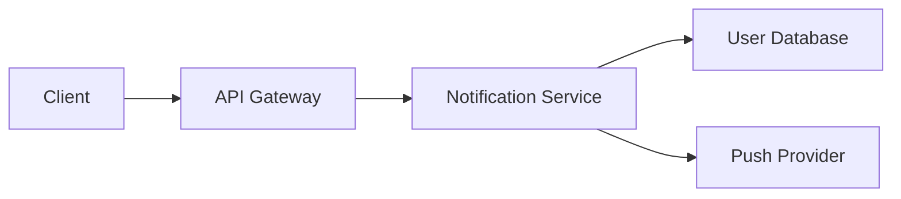



Engineering design documents are the blueprint for successful software projects. When your team works across time zones, having a well-structured wiki template becomes critical for capturing decisions, rationale, and technical details in a way that supports asynchronous review. This guide provides a production-ready template optimized for remote engineering teams in 2026.

## Why Your Design Document Template Matters

Remote teams face a unique challenge: conveying complex technical decisions without the benefit of real-time whiteboard sessions. A poorly structured design document leads to misunderstood requirements, duplicated effort, and review cycles that drag on for days. Conversely, a well-designed template guides authors to include all necessary context, making reviews faster and more effective.

The best wiki templates for remote engineering teams share common characteristics. They include explicit sections for context and problem statement, ensuring every reader understands why the change matters. They require clear success criteria so reviewers can objectively evaluate whether the proposal meets requirements. They also incorporate decision history, capturing why certain approaches were chosen over alternatives.

## The Engineering Design Document Template

Here is a battle-tested template you can adapt for your team's wiki:

```markdown
# [Title: Short, descriptive name]

## Problem Statement
- **Current State**: Describe the existing behavior or gap
- **Impact**: Who is affected and how?
- **Why Now**: What changed that makes this necessary?

## Goals and Non-Goals
### Goals
- [ ] Specific, measurable objective 1
- [ ] Specific, measurable objective 2

### Non-Goals
- What this proposal explicitly does NOT address
- Deferred concerns that need separate discussion

## Technical Design

### Architecture Changes
Diagrams or descriptions of structural changes. For API changes, include endpoint signatures.

### Data Model
Schema changes, new fields, or data flow modifications.

### API Specification
```json
{
 "endpoint": "/api/v1/resource",
 "method": "POST",
 "request": { "field": "type" },
 "response": { "status": "201 Created" }
}
```

### Security Considerations
Authentication requirements, permission changes, data handling.

## Alternatives Considered
| Alternative | Pros | Cons | Why Not Selected |
|-------------|------|------|-------------------|
| Option A    | ...  | ...  | ...               |
| Option B    | ...  | ...  | ...               |

## Implementation Plan
### Phase 1: [Name]
- [ ] Task breakdown item
- [ ] Task breakdown item

### Phase 2: [Name]
- [ ] Task breakdown item

## Success Metrics
- Metric 1: How to measure, target value
- Metric 2: How to measure, target value

## Reviewers
- @reviewer1 - Domain expert
- @reviewer2 - Security review
- @reviewer3 - API stability

```

## Integrating Async Review Workflow

The template above includes dedicated sections for reviewers because async review requires explicit ownership. For distributed teams, establish clear conventions:

Review Assignment: Assign reviewers based on expertise areas. The template's reviewer section makes this explicit and helps authors identify necessary stakeholders before publishing.

Comment Conventions: Use a consistent format for feedback:

```markdown
## Review Comments

### Blocking (Must address before merge)
- [ ] **@author**: Comment explaining the issue and suggested resolution

### Non-Blocking (Optional improvements)
- [ ] **@author**: Suggestion with optional implementation guidance

### Questions (Clarification needed)
- [ ] **@author**: Question for author to address
```

This structure helps authors distinguish between issues that require changes and suggestions they can choose to address. It also speeds up response time because everyone understands the priority level of each comment.

Response Time Expectations: Document your team's SLA for review responses. For most remote teams, a 24-hour initial response and 72-hour resolution window works well. Add these expectations to your wiki's contribution guidelines.

## Practical Example: API Design Review

Consider a team implementing a new feature endpoint. Using the template, the author documents:

```markdown
# User Notification Preferences API

## Problem Statement
- **Current State**: Users can only modify notification settings through the web UI
- **Impact**: Mobile apps cannot provide notification management, leading to support tickets
- **Why Now**: Mobile app launch scheduled for Q2 requires this API

## Goals and Non-Goals
### Goals
- [ ] Expose notification preferences via REST API
- [ ] Support preferences for email, push, and SMS channels
- [ ] Maintain backward compatibility with existing UI

### Non-Goals
- Push notification delivery infrastructure
- Email template customization
```

The reviewer can then assess whether the goals are appropriate, check if non-goals are correctly scoped, and verify the technical design matches the requirements—all without scheduling a meeting.

## Tips for Effective Remote Design Reviews

Start with a draft: Before requesting formal review, share a preliminary draft in your team's async discussion channel. This catches fundamental misunderstandings early and saves everyone time.

Use visual aids: Include architecture diagrams, sequence charts, or mockups. A picture often resolves confusion that paragraphs of text cannot. Tools like Mermaid diagrams render directly in most wikis:



Keep proposals focused: If your design document exceeds 2000 words, consider splitting it. Smaller, focused documents review faster and attract more thorough feedback.

Track decisions explicitly: Once review concludes, update your document with final decisions and rationale. Future team members will thank you.

## Adapting the Template for Your Team

Every team has unique needs, but this template provides a solid foundation. Start with the core sections and add custom fields as your processes mature. The key is consistency—using the same structure across all design documents makes them easier to find, review, and maintain.

Your wiki platform may require adjustments. Confluence users might convert the markdown sections to numbered headings. Notion teams can create database properties for tracking review status. The fundamental structure remains valuable regardless of platform.

The best design document template is one your team actually uses. Implement this template, gather feedback from your reviewers, and iterate. Over time, you'll develop conventions that match your team's communication style and technical culture.

## Adapting Templates by Platform

Different wiki platforms require format adjustments:

### Confluence-Specific Considerations
Confluence natively supports decision tracking and voting. use these features:

```
# Design Document: [Title]

{toc}

## Problem Statement
- **Current State**: [description]
- **Impact**: [who/how]
- **Why Now**: [trigger]

## Goals and Non-Goals

**Goals**
[Use Confluence checklists—easier to mark as completed]

## Technical Design
[Confluence tables work better than markdown for comparisons]

## Decision Log
{expand-include:Decision_History_Template}

{decision:decision-123}
Chosen Option A for scalability
Decided by: @architect
Date: 2026-03-15
```

**Confluence-specific plugins that enhance templates:**
- Gliffy for architecture diagrams
- Scriptrunner for automated workflow transitions
- Analytics to track document engagement

### Notion-Based Design Document Setup
Notion excels at multi-view organization. Create a design document database:

```
Database Properties:
- Title [text]
- Status [select: Draft/In Review/Approved/Shipped]
- Team [select: Backend/Frontend/DevOps]
- Priority [select: Critical/High/Medium]
- Review Deadline [date]
- Assignees [person]
- Related Documents [relation]
- Technical Depth [number 1-5]

Views:
1. Timeline view (by review deadline)
2. Gallery view (by status)
3. Kanban view (by approval stage)
4. Calendar view (milestones)
```

Notion's relation feature lets you link related documents automatically, creating a knowledge graph of your architecture decisions.

### GitHub-Based Design Documents
For teams already using GitHub, store design documents as markdown in a dedicated repository:

```bash
# Directory structure
architecture/
├── decisions/
│   ├── 0001-microservices-architecture.md
│   ├── 0002-event-driven-apis.md
│   └── 0003-database-sharding-strategy.md
├── rfcs/
│   └── [latest features]
└── adr/
    └── [architecture decision records]
```

Use GitHub's review features naturally—design docs are just code to your team:

```markdown
---
adr: 0001
title: Microservices Architecture Decision
status: Approved
date: 2026-03-15
reviewer: @architect, @devops-lead
---

# Microservices Architecture

## Problem
Monolithic codebase has become unwieldy at scale.

## Decision
Migrate to microservices with async messaging.

## Consequences
- (+) Scaling independence per service
- (-) Operational complexity increases
- (-) Network latency between services

## Alternatives Considered
...
```

## Real-World Implementation Examples

### Example 1: Startup Scale-Up Design Doc
A Series B startup needed to document their move from monolith to microservices:

**Original approach:** Lengthy 50-page document—nobody read it
**Fixed approach:** Split into 3 focused design docs:
1. Service decomposition strategy (5 pages)
2. Event streaming architecture (4 pages)
3. API gateway and routing layer (3 pages)

Result: Reviewers actually completed feedback in 72 hours instead of 3 weeks.

### Example 2: Enterprise API Standardization
Enterprise team standardizing 100+ APIs across divisions:

**Challenge:** Previous template required too much detail, killed adoption
**Solution:** Create tiered templates:
- **Tier 1** (simple CRUD APIs): 1-page minimal template
- **Tier 2** (complex integrations): Standard full template
- **Tier 3** (critical infrastructure): Extended template with security audit

Result: Adoption increased from 20% to 85% within 2 months.

### Example 3: Distributed Team Async Review
Global team across 4 time zones needed to review designs without blocking:

**Challenge:** Real-time discussions didn't work; async reviews were slow
**Solution:** Added review phases with explicit time windows:

```
Phase 1: Author Draft (48 hours)
→ Submit via wiki

Phase 2: Async Feedback (72 hours)
→ Reviewer 1 and 2 leave comments
→ Use comment threads per section

Phase 3: Response (48 hours)
→ Author responds to each thread
→ Marks "Addressed," "Deferred," or "Disagree + Discussion"

Phase 4: Resolution (24 hours)
→ Reviewers confirm resolution or escalate
→ Decision log updated

Total: 7 days vs. weeks of back-and-forth
```

## Template Customization Checklist

When implementing the template, ensure you've customized for your team:

- [ ] Replaced placeholder section names with your jargon
- [ ] Added domain-specific sections (e.g., "Compliance Impact" for fintech)
- [ ] Set realistic time expectations for reviews
- [ ] Identified who should review each section (backend, security, etc.)
- [ ] Created example documents showing good vs. poor format
- [ ] Documented your decision-log process (how decisions get marked final?)
- [ ] Trained team on using review comments productively
- [ ] Set up notifications so reviewers don't miss reviews
- [ ] Created "decision history" archives after designs ship
- [ ] Scheduled quarterly template reviews to catch pain points

## Common Pitfalls to Avoid

**Too Many Required Sections**
Teams skip templates with 15+ sections. Keep mandatory sections under 8; make others optional by role.

**Vague Success Criteria**
"Good performance" doesn't work. Specify metrics: "Page load time under 500ms," "Support ticket volume under 2/week."

**Review Without Deadlines**
Design documents need decision dates. If no deadline, they drift indefinitely. Set clear SLAs: "24-hour initial response, 5-day complete review."

**Fire-and-Forget Designs**
After approval, designs should be stored with easy lookup. Build a searchable archive. Link past decisions to new design docs to prevent repeated work.

**No Cross-Team Visibility**
Silos emerge when teams don't see other designs. Use a central wiki everyone can search. Design discovery prevents duplication.

---


## Frequently Asked Questions


**Who is this article written for?**

This article is written for developers, technical professionals, and power users who want practical guidance. Whether you are evaluating options or implementing a solution, the information here focuses on real-world applicability rather than theoretical overviews.


**How current is the information in this article?**

We update articles regularly to reflect the latest changes. However, tools and platforms evolve quickly. Always verify specific feature availability and pricing directly on the official website before making purchasing decisions.


**Are there free alternatives available?**

Free alternatives exist for most tool categories, though they typically come with limitations on features, usage volume, or support. Open-source options can fill some gaps if you are willing to handle setup and maintenance yourself. Evaluate whether the time savings from a paid tool justify the cost for your situation.


**How do I get my team to adopt a new tool?**

Start with a small pilot group of willing early adopters. Let them use it for 2-3 weeks, then gather their honest feedback. Address concerns before rolling out to the full team. Forced adoption without buy-in almost always fails.


**What is the learning curve like?**

Most tools discussed here can be used productively within a few hours. Mastering advanced features takes 1-2 weeks of regular use. Focus on the 20% of features that cover 80% of your needs first, then explore advanced capabilities as specific needs arise.


## Related Articles

- [Remote Team Meeting Cadence Template for Engineering](/remote-work-tools/remote-team-meeting-cadence-template-for-engineering-manager/)
- [Remote Team One on One Meeting Template for Engineering](/remote-work-tools/remote-team-one-on-one-meeting-template-for-engineering-mana/)
- [Deal Brief: [Company Name]](/remote-work-tools/how-to-set-up-remote-sales-team-deal-room-with-shared-docume/)
- [Remote Meeting Agenda Template for Engineering Teams](/remote-work-tools/remote-meeting-agenda-template-for-engineering-teams/)
- [Best Practice for Remote Team Documentation Scaling When](/remote-work-tools/best-practice-for-remote-team-documentation-scaling-when-wiki-becomes-unwieldy/)

Built by theluckystrike — More at [zovo.one](https://zovo.one)

