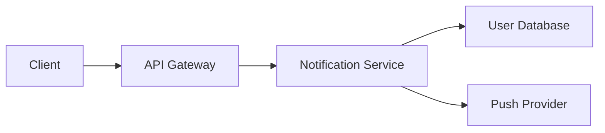


# Best Wiki Template for Remote Team Engineering Design Document with Review Workflow 2026

Engineering design documents are the blueprint for successful software projects. When your team works across time zones, having a well-structured wiki template becomes critical for capturing decisions, rationale, and technical details in a way that supports asynchronous review. This guide provides a production-ready template optimized for remote engineering teams in 2026.

## Why Your Design Document Template Matters

Remote teams face an unique challenge: conveying complex technical decisions without the benefit of real-time whiteboard sessions. A poorly structured design document leads to misunderstood requirements, duplicated effort, and review cycles that drag on for days. Conversely, a well-designed template guides authors to include all necessary context, making reviews faster and more effective.

The best wiki templates for remote engineering teams share common characteristics. They include explicit sections for context and problem statement, ensuring every reader understands why the change matters. They require clear success criteria so reviewers can objectively evaluate whether the proposal meets requirements. They also incorporate decision history, capturing why certain approaches were chosen over alternatives.

## The Engineering Design Document Template

Here is a battle-tested template you can adapt for your team's wiki:

```markdown
# [Title: Short, descriptive name]

## Summary
One-paragraph overview of what this document proposes. Include the core problem and your proposed solution.

## Problem Statement
- **Current State**: Describe the existing behavior or gap
- **Impact**: Who is affected and how?
- **Why Now**: What changed that makes this necessary?

## Goals and Non-Goals
### Goals
- [ ] Specific, measurable objective 1
- [ ] Specific, measurable objective 2

### Non-Goals
- What this proposal explicitly does NOT address
- Deferred concerns that need separate discussion

## Technical Design

### Architecture Changes
Diagrams or descriptions of structural changes. For API changes, include endpoint signatures.

### Data Model
Schema changes, new fields, or data flow modifications.

### API Specification
```json
{
 "endpoint": "/api/v1/resource",
 "method": "POST",
 "request": { "field": "type" },
 "response": { "status": "201 Created" }
}
```

### Security Considerations
Authentication requirements, permission changes, data handling.

## Alternatives Considered
| Alternative | Pros | Cons | Why Not Selected |
|-------------|------|------|-------------------|
| Option A    | ...  | ...  | ...               |
| Option B    | ...  | ...  | ...               |

## Implementation Plan
### Phase 1: [Name]
- [ ] Task breakdown item
- [ ] Task breakdown item

### Phase 2: [Name]
- [ ] Task breakdown item

## Success Metrics
- Metric 1: How to measure, target value
- Metric 2: How to measure, target value

## Reviewers
- @reviewer1 - Domain expert
- @reviewer2 - Security review
- @reviewer3 - API stability

## Related Documents
- Links to ADRs, previous designs, relevant issues
```

## Integrating Async Review Workflow

The template above includes dedicated sections for reviewers because async review requires explicit ownership. For distributed teams, establish clear conventions:

Review Assignment: Assign reviewers based on expertise areas. The template's reviewer section makes this explicit and helps authors identify necessary stakeholders before publishing.

Comment Conventions: Use a consistent format for feedback:

```markdown
## Review Comments

### Blocking (Must address before merge)
- [ ] **@author**: Comment explaining the issue and suggested resolution

### Non-Blocking (Optional improvements)
- [ ] **@author**: Suggestion with optional implementation guidance

### Questions (Clarification needed)
- [ ] **@author**: Question for author to address
```

This structure helps authors distinguish between issues that require changes and suggestions they can choose to address. It also speeds up response time because everyone understands the priority level of each comment.

Response Time Expectations: Document your team's SLA for review responses. For most remote teams, a 24-hour initial response and 72-hour resolution window works well. Add these expectations to your wiki's contribution guidelines.

## Practical Example: API Design Review

Consider a team implementing a new feature endpoint. Using the template, the author documents:

```markdown
# User Notification Preferences API

## Summary
Add a RESTful endpoint for managing user notification preferences, replacing the current configuration UI-only approach.

## Problem Statement
- **Current State**: Users can only modify notification settings through the web UI
- **Impact**: Mobile apps cannot provide notification management, leading to support tickets
- **Why Now**: Mobile app launch scheduled for Q2 requires this API

## Goals and Non-Goals
### Goals
- [ ] Expose notification preferences via REST API
- [ ] Support preferences for email, push, and SMS channels
- [ ] Maintain backward compatibility with existing UI

### Non-Goals
- Push notification delivery infrastructure
- Email template customization
```

The reviewer can then assess whether the goals are appropriate, check if non-goals are correctly scoped, and verify the technical design matches the requirements—all without scheduling a meeting.

## Tips for Effective Remote Design Reviews

Start with a draft: Before requesting formal review, share a preliminary draft in your team's async discussion channel. This catches fundamental misunderstandings early and saves everyone time.

Use visual aids: Include architecture diagrams, sequence charts, or mockups. A picture often resolves confusion that paragraphs of text cannot. Tools like Mermaid diagrams render directly in most wikis:



Keep proposals focused: If your design document exceeds 2000 words, consider splitting it. Smaller, focused documents review faster and attract more thorough feedback.

Track decisions explicitly: Once review concludes, update your document with final decisions and rationale. Future team members will thank you.

## Adapting the Template for Your Team

Every team has unique needs, but this template provides a solid foundation. Start with the core sections and add custom fields as your processes mature. The key is consistency—using the same structure across all design documents makes them easier to find, review, and maintain.

Your wiki platform may require adjustments. Confluence users might convert the markdown sections to numbered headings. Notion teams can create database properties for tracking review status. The fundamental structure remains valuable regardless of platform.

The best design document template is one your team actually uses. Implement this template, gather feedback from your reviewers, and iterate. Over time, you'll develop conventions that match your team's communication style and technical culture.


## Related Reading

- [Remote Work Guides Hub](/remote-work-tools/guides-hub/)
- [Async Weekly Recap Email Template for Remote Team Leads 2026](/remote-work-tools/async-weekly-recap-email-template-for-remote-team-leads-2026/)
- [Remote Team Runbook Template for Deploying Hotfix to.](/remote-work-tools/remote-team-runbook-template-for-deploying-hotfix-to-product/)
- [Best Wiki Tool for a 40-Person Remote Customer Support Team](/remote-work-tools/best-wiki-tool-for-a-40-person-remote-customer-support-team/)

Built by

Built by theluckystrike — More at [zovo.one](https://zovo.one)
