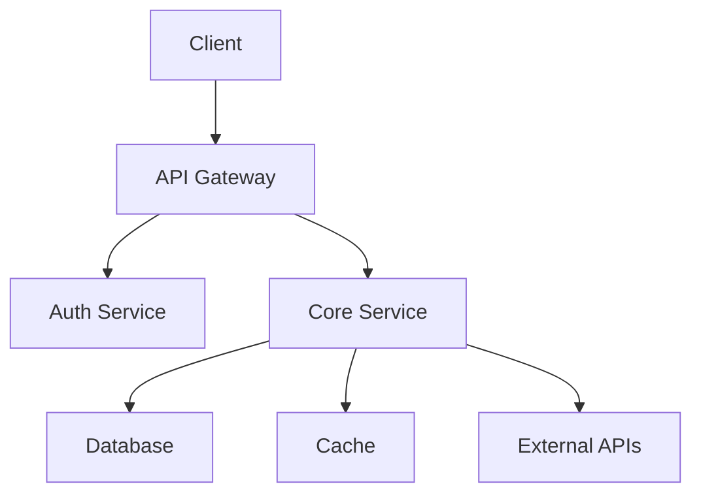



Effective onboarding documentation serves as the backbone of successful remote team integration. When your team spans multiple time zones and communicates primarily through asynchronous channels, well-structured documentation determines whether new hires become productive quickly or spend weeks digging for basic information.

This guide covers the essential components of onboarding documentation, practical templates you can adapt, and implementation strategies that work for distributed developer teams.

## Core Components of Remote Onboarding Documentation

Every remote team's onboarding documentation should address four fundamental areas: access and accounts, development environment setup, team processes and workflows, and project-specific knowledge. Skipping any of these creates gaps that slow down new team members.

### Access and Accounts Checklist

Create a checklist of every account and system access a new developer needs. This typically includes:

- Email and calendar access
- Communication platforms (Slack, Teams, Discord)
- Code repository permissions (GitHub, GitLab, Bitbucket)
- Project management tools (Jira, Linear, Asana)
- Cloud infrastructure access (AWS, GCP, Azure)
- Documentation platforms (Notion, Confluence, GitBook)
- CI/CD pipeline access

For each item, include the request procedure, expected response time, and who to contact if access is delayed. Remote developers often need these credentials before their first day—coordinate with IT to provision accounts in advance.

### Development Environment Setup

Provide step-by-step instructions for setting up a local development environment. This is where many teams lose time with repeated questions. Include:

**Prerequisites and Dependencies**

```bash
# Example: Clone repository and install dependencies
git clone git@github.com:yourorg/your-project.git
cd your-project
npm install

# Verify setup with the provided test command
npm run verify
```

**IDE Configuration**

```json
// Recommended VS Code extensions for your project
{
  "recommendations": [
    "dbaeumer.vscode-eslint",
    "esbenp.prettier-vscode",
    "ms-vscode.vscode-typescript-next"
  ]
}
```

**Environment Variables**

Document every environment variable needed, using placeholders for sensitive values:

```
DATABASE_URL=postgresql://localhost:5432/devdb
API_KEY=your_api_key_here
REDIS_URL=redis://localhost:6379
```

Create a `.env.example` file in your repository—this becomes the reference developers check when configuring their local environment.

## Team Processes and Workflows

Remote teams rely heavily on documented processes because colleagues cannot simply walk over and ask questions. Document your core workflows clearly and reference them in your onboarding materials.

### Code Review Process

Specify your team's code review conventions:

- How pull requests should be structured
- Required reviewers and approval thresholds
- Branch naming conventions
- When to request reviews vs. merge directly
- Handling merge conflicts across time zones

```markdown
## Pull Request Template

## Description
Brief description of changes

## Type of Change
- [ ] Bug fix
- [ ] New feature
- [ ] Documentation update

## Testing
- [ ] Unit tests pass locally
- [ ] Integration tests pass
- [ ] Manual testing completed

## Screenshots (if applicable)

## Related Issues
Closes #
```

### Meeting Cadence and Communication Norms

Define your team's synchronous and asynchronous communication patterns:

- Weekly team meetings and their purpose
- Daily standup format and timing
- When to use real-time chat vs. email
- Expected response times by channel
- Documentation-first approach for decisions

Include timezone coverage information so new developers understand when teammates are available for live collaboration.

## Project-Specific Knowledge

Technical documentation specific to your codebase accelerates new developer productivity significantly.

### Architecture Overview

Provide a high-level architecture diagram and explanation:



Explain the data flow, key services, and dependencies. Link to more detailed architecture documents.

### Key Endpoints and APIs

Document your core API endpoints with examples:

```javascript
// Example: Creating a new resource
POST /api/v1/users
Authorization: Bearer <token>
Content-Type: application/json

{
  "name": "Jane Developer",
  "email": "jane@example.com",
  "role": "developer"
}

// Response
{
  "id": "usr_123",
  "name": "Jane Developer",
  "email": "jane@example.com",
  "role": "developer",
  "created_at": "2026-03-15T10:30:00Z"
}
```

### Common Pitfalls and Gotchas

Document the lessons your team has learned. Include:

- Known bugs and workarounds
- Configuration gotchas that cause issues
- Third-party service limitations
- Performance considerations
- Security-related constraints

This section alone can save new developers hours of frustration.

## Implementation Strategy

### Version Control Your Documentation

Store onboarding documentation in your main repository or a dedicated docs repository. This provides version history, allows pull requests for updates, and integrates with your existing workflow.

```
docs/
├── onboarding/
│   ├── 01-access-setup.md
│   ├── 02-dev-environment.md
│   ├── 03-team-processes.md
│   ├── 04-architecture.md
│   └── README.md
```

### Keep Documentation Current

Assign documentation owners who review and update materials quarterly. Include documentation accuracy as part of team retrospectives—when someone encounters outdated information, add a task to fix it.

### Gather Feedback

Create a simple feedback mechanism for new hires:

```markdown
## Onboarding Feedback

Rate your onboarding experience (1-5):
- Access setup: ___
- Dev environment: ___
- Team processes: ___
- Architecture understanding: ___

What was missing? What could be improved?
```

Use this feedback to continuously improve your materials.

## Tools and Platforms

Several tools work well for remote team onboarding documentation:

- **GitBook** - Excellent for structured, versioned documentation
- **Notion** - Flexible workspace good for wikis and databases
- **Docusaurus** - Developer-friendly static site generator
- **Slite** - Simple team documentation with AI assistance

Choose tools that integrate with your existing workflow and support the collaborative editing your team needs.

---

Effective onboarding documentation transforms how new developers integrate into remote teams. Invest time in creating, well-organized materials, and your team will recover that investment through faster velocity and reduced knowledge silos.


## Related Articles

- [How to Create Decision Log Documentation for Remote Teams](/remote-work-tools/how-to-create-decision-log-documentation-for-remote-teams-re/)
- [How to Create Remote Team Architecture Documentation Using](/remote-work-tools/how-to-create-remote-team-architecture-documentation-using-d/)
- [How to Create Remote Team Career Ladder Documentation for](/remote-work-tools/how-to-create-remote-team-career-ladder-documentation-for-gr/)
- [How to Create Remote Team Compliance Documentation](/remote-work-tools/how-to-create-remote-team-compliance-documentation-checklist/)
- [Example: Find pages not modified in the last 180 days using](/remote-work-tools/how-to-create-remote-team-documentation-sprint-dedicating-ti/)

Built by theluckystrike — More at [zovo.one](https://zovo.one)

