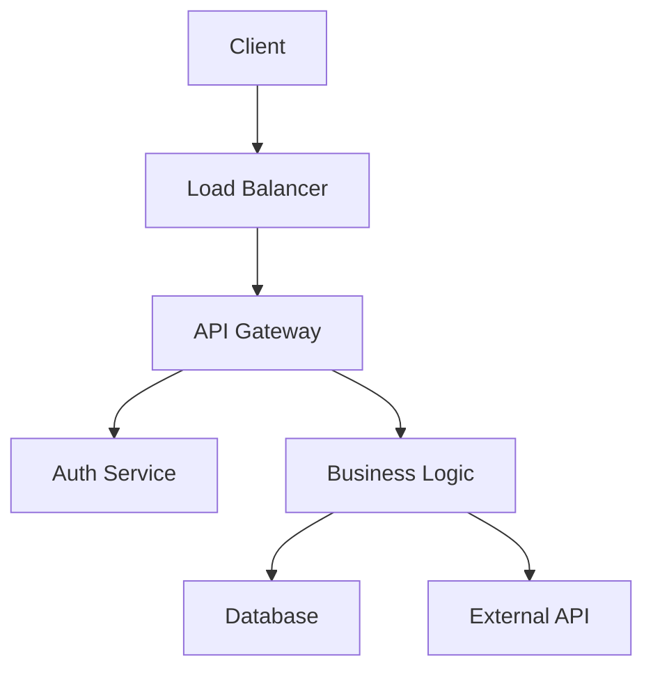
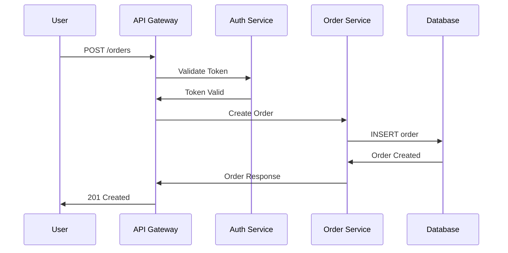
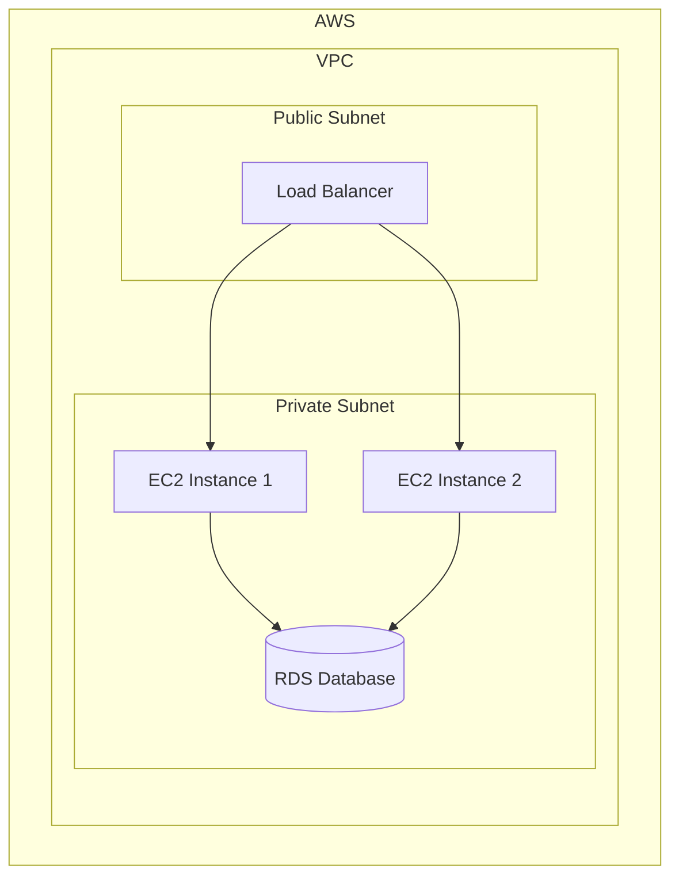


# How to Create Remote Team Architecture Documentation Using Diagrams as Code

The best approach for remote teams is using Mermaid or PlantUML to store diagrams as text files in your repository, enabling Git-based collaboration and eliminating merge conflicts that plague binary diagram tools. This guide shows you how to implement diagrams as code with practical examples, CI/CD integration strategies, and workflows that scale across time zones without requiring real-time synchronization.

## Why Diagrams as Code for Remote Teams

Traditional diagramming tools create binary files that don't merge well in version control. When team members across different time zones work on the same diagram, you encounter constant merge conflicts and lost changes. Diagrams as code treats your architecture drawings as plain text files that integrate smoothly with Git workflows.

The benefits extend beyond version control. Your diagrams become refactorable, testable, and reproducible. Teams can review diagram changes through pull requests, adding the same rigor to architecture decisions as code reviews.

## Popular Diagrams as Code Tools

Several tools fit well for remote team documentation. Mermaid.js offers the lowest barrier to entry—it renders diagrams from text directly in Markdown files. PlantUML provides more advanced diagramming capabilities with enterprise features. Structurizr combines architecture diagrams with C4 model compliance.

For most remote teams, starting with Mermaid provides immediate value without additional tooling. You can embed diagrams directly in GitHub README files, Notion pages, or any Markdown-supporting platform.

## Getting Started with Mermaid

Mermaid integrates directly with Markdown. Create a file named `architecture.md` and add your first diagram:



This flowchart renders automatically in platforms supporting Mermaid. The syntax reads like code—easy to write, review, and modify in pull requests.

## Documenting Service Architecture

For microservices architectures, sequence diagrams clarify service interactions. Here's how to document an API request flow:



This sequence diagram shows exactly how requests flow through your system. Remote team members can read the flow without needing a live demo or screen share.

## Infrastructure Documentation

Document cloud infrastructure using deployment diagrams:



Infrastructure diagrams in code enable Infrastructure as Code practices. When your Terraform changes, update the diagram to match—keeping documentation synchronized with reality.

## C4 Model for Architecture Context

The C4 model provides a standardized approach to architecture documentation. Structurizr supports C4 through DSL:

```java
workspace {
    model {
        person = person "User" "Uses the system"
        softwareSystem = softwareSystem "E-Commerce Platform" "Online store"
        
        container = container "Web App" "React SPA" "Serves pages"
        containerAPI = container "API" "Node.js API" "Business logic"
        containerDB = container "Database" "PostgreSQL" "Stores data"
        
        person -> softwareSystem "Visits"
        softwareSystem -> container "Delivers"
        container -> containerAPI "API Calls"
        containerAPI -> containerDB "Reads/Writes"
    }
    
    views {
        systemContext softwareSystem "SystemContext" {
            include *
            autoLayout
        }
        
        container softwareSystem "Container" {
            include *
            autoLayout
        }
    }
}
```

Remote teams benefit from C4's standardized levels. New team members start with the context diagram, then drill into containers and components as needed.

## Git Workflow for Diagram Collaboration

Treat diagram files like source code in your workflow:

1. Create a branch for diagram updates
2. Write or modify diagram code in a feature branch
3. Submit pull request with diagram changes
4. Review changes like code—check accuracy and style
5. Merge after approval

This workflow ensures architecture changes receive proper scrutiny. Teams often require diagram updates alongside code changes for new features.

## Embedding Diagrams in Documentation

Jekyll sites support Mermaid through plugins or CDN includes. Add this to your layout:

```html
<script type="module">
  import mermaid from 'https://cdn.jsdelivr.net/npm/mermaid@10/dist/mermaid.esm.min.mjs';
  mermaid.initialize({ startOnLoad: true });
</script>
```

Your Markdown files then render diagrams automatically. This approach works with GitHub Pages, Netlify, or any static hosting.

## Best Practices for Remote Teams

Maintain diagram quality across distributed teams by following these practices:

**Keep diagrams small.** Large diagrams become unreadable. Break complex systems into multiple smaller diagrams showing specific aspects.

**Use consistent styling.** Establish naming conventions, color schemes, and layout patterns. Consistent diagrams are easier to understand quickly.

**Version diagrams with code.** When services change, update diagrams in the same PR. This prevents documentation drift.

**Write diagram descriptions.** Add context explaining what the diagram shows and any assumptions. Future readers—including future you—will appreciate the clarity.

**Review diagrams in PRs.** Treat diagram changes as code reviews. Check for accuracy, clarity, and consistency with existing documentation.

## Automating Diagram Generation

For dynamic architectures, generate diagrams from code:

```python
def generate_deployment_diagram(services):
    mermaid = "graph TD\n"
    for service in services:
        mermaid += f'    {service["name"]}[{service["label"]}]\n'
        for dep in service.get('dependencies', []):
            mermaid += f'    {service["name"]} --> {dep}\n'
    return mermaid
```

Automated generation keeps documentation synchronized with deployed services. Run generation as part of your CI pipeline to ensure diagrams always reflect current state.


## Related Articles

- [How to Create Remote Team Architecture Decision Record](/remote-work-tools/how-to-create-remote-team-architecture-decision-record-templ/)
- [How to Create Remote Team Career Ladder Documentation for](/remote-work-tools/how-to-create-remote-team-career-ladder-documentation-for-gr/)
- [How to Create Remote Team Compliance Documentation](/remote-work-tools/how-to-create-remote-team-compliance-documentation-checklist/)
- [Example: Find pages not modified in the last 180 days using](/remote-work-tools/how-to-create-remote-team-documentation-sprint-dedicating-ti/)
- [Project Kickoff: [Project Name]](/remote-work-tools/how-to-create-remote-team-project-kickoff-documentation-temp/)

Built by theluckystrike — More at [zovo.one](https://zovo.one)

