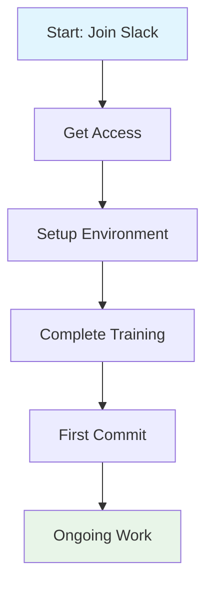



Designing an accessible remote team handbook for neurodiverse employees requires intentional structural choices that accommodate diverse cognitive processing styles. This guide provides developers and power users with practical implementation patterns for creating handbooks that serve all team members effectively.

## Understanding Neurodiverse Information Processing

Neurodiverse employees process information differently. Some individuals read linearly and retain information through sequential steps. Others scan documents for keywords and miss context buried in paragraphs. Some need visual anchors to navigate lengthy content, while others find visual noise overwhelming.

Effective handbooks accommodate these variations by offering multiple entry points, consistent formatting, and explicit structure. The goal is reducing cognitive load while maximizing information retention.

## Core Structural Principles

### Consistent Section Naming

Use identical section titles across all handbook pages. When users encounter "Getting Started" in one document, they should find the same content type under that heading elsewhere.

```markdown
# HandBook Structure Template
sections:
  - title: "Getting Started"
    description: "First-day information and orientation"
    expected_length: "500-800 words"
  - title: "Policies"
    description: "Official guidelines and expectations"
    expected_length: "800-1200 words"
  - title: "Tools"
    description: "Technical setup and access information"
    expected_length: "400-600 words"
  - title: "Support"
    description: "Where to get help"
    expected_length: "300-500 words"
```

### Linear and Non-Linear Navigation Options

Structure each page so users can read sequentially or jump directly to relevant sections. Use descriptive anchor links that explain destination:

```html
<!-- Instead of vague links -->
<a href="#setup">Setup</a>

<!-- Use descriptive navigation -->
<nav aria-label="Page sections">
  <a href="#overview">Overview: What this page covers</a>
  <a href="#prerequisites">Prerequisites: What you need first</a>
  <a href="#step-by-step">Step-by-step: Complete instructions</a>
  <a href="#troubleshooting">Troubleshooting: Common issues</a>
  <a href="#faq">FAQ: Quick answers</a>
</nav>
```

## Content Formatting for Comprehension

### Chunked Information

Break content into small, digestible units. Use bullet points for lists, numbered steps for sequences, and short paragraphs for concepts.

```markdown
## Communication Expectations

### Response Windows
- **Slack/Direct messages**: Response expected within 4 hours during work hours
- **Email**: Response expected within 24 hours
- **Urgent flagged items**: Response expected within 1 hour

### Meeting Etiquette
- Camera optional for all meetings unless explicitly required
- Recording available for all meetings upon request
- Agenda distributed 24 hours in advance
- Notes shared within 4 hours after meeting
```

### Explicit Context

Avoid assuming readers understand implied context. State assumptions explicitly:

```markdown
<!-- Instead of -->
Install the CLI tool and configure it.

<!-- Use explicit language -->
Install the CLI tool by running `npm install -g our-cli-tool`. 
After installation, configure it by creating a config file at 
`~/.ourtool/config.yaml` with your API credentials.
```

## Multiple Format Options

Provide the same information in different formats to serve diverse processing preferences.

### Text Version

Plain text with clear headings serves screen reader users and those who prefer linear reading.

### Checklist Version

For procedural content, offer checklist formats:

```markdown
## First Week Checklist

- [ ] Set up development environment (see [Environment Setup Guide])
- [ ] Request access to GitHub organization (submit ticket #access)
- [ ] Join required Slack channels: #engineering, #standup, #code-review
- [ ] Complete security training (approx. 45 minutes)
- [ ] Schedule 1:1 with your manager
```

### Visual Version

Include diagrams for complex workflows:



## Search and Findability

Neurodiverse users often search for specific information rather than reading full documents. Optimize for search:

### Keyword-Rich Headings

```markdown
## How to Request Time Off: Submitting PTO in HR Portal

## Password Reset: Troubleshooting Common Issues

## VPN Setup: Connecting from Home Networks
```

### Internal Cross-References

Link related content explicitly:

```markdown
For environment setup, see [Development Environment Setup Guide].
For code review process, see [Code Review Standards].
For deployment procedures, see [CI/CD Pipeline Documentation].
```

## Accessibility Technical Implementation

### Semantic HTML Structure

Use proper heading hierarchy and ARIA labels:

```html
<main>
  <h1>Page Title</h1>
  <section aria-labelledby="overview-heading">
    <h2 id="overview-heading">Overview</h2>
    <p>Content here...</p>
  </section>
  <section aria-labelledby="steps-heading">
    <h2 id="steps-heading">Steps</h2>
    <ol>
      <li>First step</li>
      <li>Second step</li>
    </ol>
  </section>
</main>
```

### Contrast and Readability

Ensure text meets WCAG AA standards:

```css
/* Recommended contrast ratios */
:root {
  --text-primary: #1a1a1a;      /* 15.9:1 on white */
  --text-secondary: #4a4a4a;   /* 7.5:1 on white */
  --background-light: #ffffff;
  --background-dark: #121212;
  --link-color: #0066cc;       /* 4.6:1 - meets AA */
}
```

### Font and Spacing Recommendations

```css
/* Accessible typography */
body {
  font-family: -apple-system, BlinkMacSystemFont, "Segoe UI", Roboto, sans-serif;
  line-height: 1.6;           /* Minimum for readability */
  max-width: 70ch;            /* Optimal reading length */
  font-size: 18px;            /* Larger base size helps */
  word-spacing: 0.05em;       /* Improves readability */
}
```

## Version Control for Handbook Updates

Treat handbook content like code using version control:

```bash
# Create feature branch for handbook changes
git checkout -b handbook/update-communication-policy

# Make changes, then submit PR
git add articles/communication-policy.md
git commit -m "Update response windows for async communication"

# Use tags for major versions
git tag -a v2.0 -m "Major rewrite for neurodiversity accessibility"
```

Document changes in a changelog:

```markdown
## Changelog

### v2.1 (2026-03-15)
- Added troubleshooting section
- Improved heading clarity
- Added checklist format option

### v2.0 (2026-01-01)
- Complete restructure for accessibility
- Added multiple format options
- Improved search navigation
```

## Testing Handbook Usability

Before publishing, test with neurodiverse users:

1. **Navigation test**: Can users find specific information within 3 clicks?
2. **Format test**: Can users switch between formats without losing context?
3. **Search test**: Do keyword searches return relevant results?
4. **Screen reader test**: Does content make sense when read linearly?
5. **Chunking test**: Can users complete a task using only the handbook?

Collect feedback through:
- Anonymous surveys after onboarding
- Optional feedback button on each page
- Regular UX reviews with neurodiverse team members

## Maintenance and Evolution

Accessibility is not a one-time achievement. Establish regular review cycles:

```yaml
# Review schedule
review_cycle:
  - frequency: "quarterly"
    focus: "content accuracy"
    owner: "content team"
  - frequency: "annually"
    focus: "accessibility audit"
    owner: "accessibility specialist"
  - frequency: "as-needed"
    focus: "user feedback implementation"
    owner: "product team"
```

Update the handbook when policies change, tools evolve, or user feedback indicates confusion. Version control makes tracking changes straightforward and allows rolling back problematic updates.

## Related Articles

- [Remote Team Handbook: Structure and Template](/remote-work-tools/how-to-structure-remote-team-handbook-table-of-contents-cove/)
- [Best Notion Template for Remote Team Handbook Covering HR](/remote-work-tools/best-notion-template-for-remote-team-handbook-covering-hr-policies-and-team-norms-2026/)
- [How to Build a Remote Team Handbook from Scratch](/remote-work-tools/how-to-build-a-remote-team-handbook-from-scratch/)
- [How to Structure Remote Team Handbook: Policies, Processes](/remote-work-tools/how-to-structure-remote-team-handbook-covering-policies-proc/)
- [Best Notion Template for Remote Team Handbook](/remote-work-tools/best-notion-template-for-remote-team-handbook-covering-hr-policies-and-team-norms/)

Built by theluckystrike — More at [zovo.one](https://zovo.one)

