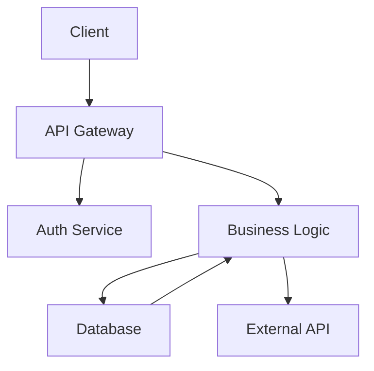



Hybrid meetings present a unique challenge when visual collaboration tools like whiteboards are involved. You have participants in a physical room looking at a real whiteboard, while remote participants see something completely different through their screens. This asymmetry creates friction, reduces engagement, and often leaves remote team members at a disadvantage. Getting this right requires deliberate tooling choices, clear help protocols, and sometimes a complete rethinking of how visual collaboration happens.

This guide provides practical strategies for handling the hybrid whiteboard challenge, with specific examples tailored for developers and technical teams who need precise, efficient collaboration tools.

## Prerequisites

Before you begin, make sure you have the following ready:

- A computer running macOS, Linux, or Windows
- Terminal or command-line access
- Administrator or sudo privileges (for system-level changes)
- A stable internet connection for downloading tools


### Step 1: The Core Problem: Two Different Experiences

In a typical hybrid whiteboard scenario, your in-room participants see a physical whiteboard or a large shared screen. They can point naturally, write with markers, and engage with the space intuitively. Remote participants, meanwhile, see a video feed that may be grainy, poorly framed, or delayed. They can't easily point at what they want to discuss, and their annotations may feel disconnected from what in-room participants are doing.

This creates a two-tier experience where some participants have full agency while others are reduced to passive observers. The solution isn't to eliminate physical whiteboards—many teams find them irreplaceable for certain types of thinking—but to create an unified experience that works for everyone.

### Step 2: Strategy 1: Use Digital Whiteboard Tools as the Primary Canvas

The most straightforward approach is to abandon physical whiteboards entirely for hybrid sessions and use digital alternatives exclusively. Tools like Miro, FigJam, MURAL, or Microsoft Whiteboard give every participant an identical view and equal ability to contribute.

For developers, this often works well because these tools integrate with workflows you're already using. Here's a sample meeting setup script for initializing a collaborative digital whiteboard:

```javascript
// Example: Automating whiteboard session setup with Miro API
const miro = require('miro-api');

async function createTeamWhiteboard(sessionTitle, participants) {
  const board = await miro.board.create({
    name: sessionTitle,
    description: `Collaborative session - ${new Date().toDateString()}`
  });

  // Add standard templates for common meeting types
  await board.addWidget('shape', {
    x: 0,
    y: 0,
    width: 800,
    height: 200,
    content: 'Agenda items will go here'
  });

  // Share with participants
  for (const email of participants) {
    await board.invite(email, 'editor');
  }

  return board.viewLink;
}
```

This approach ensures everyone starts with the same view and can contribute equally. The main downside is losing the tactile quality of physical whiteboards, which some teams find valuable for brainstorming sessions.

### Step 3: Strategy 2: Mirror Physical Whiteboards Digitally

If your team values physical whiteboards, you can create a hybrid system where a document camera or dedicated whiteboard camera feeds live video to remote participants, while a digital whiteboard tool runs in parallel for remote annotations.

Equipment setup for this strategy typically includes:

- A document camera (like IPEVO VZ-R) pointed at the physical whiteboard
- A wide-angle room camera for participant visibility
- A laptop running both the video feed and a digital whiteboard app
- Good lighting on the physical whiteboard to ensure readability

The help protocol matters more than the equipment. When someone in the room points at the physical whiteboard, they should simultaneously describe what they're pointing at for remote participants. When remote participants annotate on the digital whiteboard, someone in the room needs to read those annotations aloud.

Here's a help template you can use:

```
### Step 4: Hybrid Whiteboard Session Protocol

### Starting the Session
1. Confirm remote participants can see the physical whiteboard clearly
2. Test audio levels - in-room mic should pick up everyone
3. Assign a "digital scribe" role to one remote participant
4. Explain: "When I point at the board, I'll describe what I'm referring to"

### During Discussion
- In-room: "I'm pointing at the top-left section where we outlined the API design"
- Remote: Use chat to flag important moments, type annotations to the digital board
- Scribe: Summarize key decisions in both physical and digital formats

### Ending the Session
- Photograph the physical whiteboard from multiple angles
- Export the digital whiteboard immediately
- Post both to your team wiki or shared folder
- Send summary within 1 hour while context is fresh
```

### Step 5: Strategy 3: Switch Between Modalities

Some meetings don't need a whiteboard throughout. A practical approach is to alternate between modes based on the current activity:

- Discussion phases: Everyone on video, no whiteboard
- Brainstorming phases: Switch to digital whiteboard
- Synthesis phases: Physical whiteboard for quick diagramming
- Decision phases: Digital whiteboard for voting and documentation

This switching approach respects that different collaboration modes suit different tasks. It also gives remote participants predictable moments when their contribution tools will be most effective.

For technical teams, this might look like:

1. **Problem definition** (5 min): Video discussion
2. **Architecture sketching** (20 min): Digital whiteboard with everyone contributing
3. **Code walkthrough** (15 min): Screen share with code-focused discussion
4. **Action items** (5 min): Physical whiteboard for quick capture, photo shared afterward

### Step 6: Handling the Technical Details

Beyond strategy, the technical execution determines whether your hybrid whiteboard sessions succeed or frustrate everyone.

### Camera Positioning

Place your whiteboard camera at an angle that minimizes shadows and ensures remote participants can read what's written. Test from the remote participant's perspective—can they read the smallest text? If not, write larger or invest in a better camera setup.

### Audio Considerations

This is often the overlooked factor. When participants discuss around a physical whiteboard, their voices bounce around the room. Remote participants may struggle to identify who's speaking or hear clearly through the echo. Consider:

- A directional microphone near the whiteboard area
- Acoustic panels to reduce echo in the room
- Requiring speakers to use lapel microphones or stay near the main mic

### Annotation Latency

If remote participants annotate on a digital whiteboard while in-room participants use a physical board, there's a synchronization problem. The solution is simple but requires discipline: the in-room "scribe" role must immediately transfer digital annotations to the physical board or vice versa. Don't let the two canvases diverge.

### Step 7: Practical Tools for Developer Teams

For technical teams specifically, consider these tooling approaches:

**Code-first diagramming tools** like Mermaid or Excalidraw work well because they generate diagrams from text. Everyone can contribute via code comments, and the rendered output appears instantly on the shared canvas:



This approach is particularly powerful because diagrams become version-controllable and discussion happens in code review style rather than real-time annotation battles.

**GitHub Projects or Linear** with integrated whiteboarding features work for teams already living in these tools. The advantage is keeping design discussions in the same space where implementation happens.

### Step 8: Measuring Success

Track these metrics to improve your hybrid whiteboard sessions:

- Participation parity: Are remote and in-room participants contributing equally?
- Follow-up clarity: Do post-meeting summaries accurately capture whiteboard content?
- Time to consensus: Are decisions being made efficiently, or does the hybrid format create confusion?
- Participant satisfaction: Survey both remote and in-room participants after key sessions

## Common Mistakes to Avoid

Teams often struggle with hybrid whiteboard sessions because they:

- Equip the room poorly: A laptop webcam pointed at a whiteboard rarely works
- Don't assign roles: Without explicit assignments, no one manages the hybrid experience
- Forget remote perspective: What seems obvious in the room is often invisible remotely
- Mix modalities without protocol: Trying to use both physical and digital whiteboards without clear rules creates chaos
- Skip documentation: Whiteboard content disappears within days without intentional capture

### Step 9: Equipment Deep-Dive: Specific Products for Hybrid Whiteboarding

If choosing physical-whiteboard-mirroring approach, here's what actually works:

**Document Cameras (Best for Physical Whiteboard Mirroring)**
- **IPEVO VZ-R** ($300-400): 4K resolution, excellent for reading text on whiteboards, includes document annotation software
- **Hue Document Camera** ($500-600): Professional-grade, built-in stand, excellent focus clarity
- **CZUR ExpertBook Pro** ($800): Dual cameras for extreme wide-angle coverage, AI-powered content enhancement
- Reality: Most teams find that a camera alone isn't sufficient; they need both camera feed + room camera for participant visibility

**Digital Whiteboard Tools (Recommended as Primary Solution)**

| Tool | Price | Best For | Integration |
|------|-------|----------|-------------|
| Miro | $120/user/year | Teams wanting powerful collaboration | Slack, Jira, Figma |
| FigJam | $240/user/year (with Figma) | Design-heavy teams | Figma-native, excellent |
| MURAL | $130-400/mo | Enterprise, large team planning | Slack, Teams, Salesforce |
| Microsoft Whiteboard | Free with Office 365 | Microsoft-centric orgs | Teams, SharePoint |
| Excalidraw | Free | Developers, architects | GitHub, open-source, no vendor lock |
| Matterboard | Free/paid | Real-time collaboration | Slack integration |

### Step 10: Set Up Effective Hybrid Whiteboard Sessions: Detailed Workflow

This workflow works for technical teams (brainstorming architecture, debugging code, planning sprints):

**Before the Meeting (2-3 days ahead)**

1. Create the digital whiteboard canvas and share link
2. Seed it with meeting agenda/structure
3. Invite all participants to preview (they can add questions/ideas asynchronously)
4. For physical whiteboard option: Set up camera and test lighting
5. Assign roles:
 - Digital scribe (remote person who types what's being discussed)
 - Physical scribe (in-room person who transcribes digital annotations)
 - Facilitator (keeps discussion moving)
 - Timekeeper (if meeting is long)

**Opening (First 5 minutes)**

1. Tech check: Can everyone see both physical and digital boards?
2. Explain: "For this hour, we're using [tool]. Everyone contributes equally—remote and in-room."
3. Clarify roles: Who's typing? Who's watching the camera feed?
4. Establish signal: "I'll say 'digital update' when typing async content to the board, 'audio only' when discussing."

**During Discussion (Main Body)**

For technical discussions, use this rhythm:
- **Speak**: Person verbally explains their idea (2-3 minutes)
- **Draw**: Facilitator or speaker adds sketch to digital board
- **Label**: Scribe types explanation/context
- **React**: Everyone adds sticky notes (questions, alternatives, thumbs up/down)
- **Synthesize**: Facilitator summarizes and asks clarifying questions

For architecture decisions in particular, this pattern works:

```
1. State the problem (verbal, 2 min)
2. Propose solution A (sketch on board, 3 min)
3. Propose solution B (sketch on board, 3 min)
4. Remote folks annotate pros/cons (2 min async in digital whiteboard)
5. In-room folks discuss and react (2 min)
6. Vote (Miro reactions, quick consensus check)
7. Document decision with rationale (scribe types, 2 min)
```

**Closing (Last 5 minutes)**

1. Facilitator reads back decisions made
2. Assign action items with owners and deadlines
3. Explain: "This whiteboard will be archived here [link]. Check here tomorrow."
4. Quick poll: "Everyone feel heard?"

**Post-Meeting (Within 2 hours)**

1. Export whiteboard as PDF and image files
2. Post to shared drive with meeting date
3. For significant decisions, create decision record (see example below)
4. Send summary email within 2 hours while context is fresh

### Step 11: Decision Record Template for Hybrid Whiteboard Sessions

Every important whiteboard discussion should produce a decision record:

```markdown
# Decision Record: [Topic]

**Date**: [Meeting date]
**Participants**: [Who attended, how many remote vs. in-room]
**Facilitator**: [Name]
**Original Whiteboard**: [Link to exported PDF/image]

### Step 12: Problem Statement
[What were we trying to decide?]

### Step 13: Options Discussed
1. Option A: [Description]
2. Option B: [Description]
3. Option C: [Description]

### Step 14: Pros and Cons Identified

### Option A
- Pro: [Listed during meeting]
- Con: [Listed during meeting]

### Option B
- Pro: [Listed during meeting]
- Con: [Listed during meeting]

[etc.]

### Step 15: Decision Made
We're moving forward with **Option B** because [key reason from discussion].

### Step 16: Rationale
[Expand on why this was the best choice given the tradeoffs]

## Next Steps
- [ ] Action Item 1 — Owner: [Name] — Due: [Date]
- [ ] Action Item 2 — Owner: [Name] — Due: [Date]

### Step 17: Participants Who Influenced Decision
- In-room: [Names of people whose ideas shaped decision]
- Remote: [Names of remote participants whose input was incorporated]

**This ensures remote participants feel credited for their contributions.**
```

## Troubleshooting Hybrid Whiteboard Issues in Real Time

If problems arise during the meeting:

**Issue: Remote person can't see the whiteboard clearly**
- Quick fix: Zoom in on whiteboard camera feed; reduce field of view to focus on content area
- Or: Switch to digital board as primary, use physical board as secondary reference only
- Longer fix: Improve camera setup before next meeting

**Issue: In-room and digital boards are diverging (different content)**
- Immediate: Pause discussion, align both boards
- Role clarity: Designate one person to manage alignment (scribe on digital updates physical, or vice versa)
- Prevent: After adding to physical board, immediately add to digital board

**Issue: Remote person keeps being forgotten mid-discussion**
- Recovery: Facilitator pauses, asks remote person for input explicitly: "[Remote Name], what's your take?"
- Prevent: Rotate who speaks first—Remote person leads next topic
- Structure: Use round-robin speaking order (go around list of participants rather than free-form)

**Issue: Meeting is running long; can't capture everything**
- Real-time: Recording the meeting; you can screenshot from recording later
- Triage: Document key decisions NOW; capture details after meeting while reviewing recording
- Prevent: Stricter timeboxing by topic; use timer

**Issue: In-room participants are dominating; remote folks aren't participating**
- Intervention: Facilitator says: "Let's hear from remote team. [Names], what questions came up for you?"
- Structural: Require remote person to lead digital board updates (they control what gets typed)
- Tool: Use voting/reaction features (Miro reactions, emoji votes in whiteboard) to hear from quieter participants

### Step 18: Technical Architecture for Optimal Setup

The most reliable setup combines three technology layers:

```
┌─────────────────────────────────────────┐
│ Remote Participants' View                │
├─────────────────────────────────────────┤
│ Video of in-room people (small)         │
│ Digital whiteboard (large, 70% of view) │
│ Chat sidebar (20% of view)              │
└─────────────────────────────────────────┘

┌─────────────────────────────────────────┐
│ In-Room Participants' View               │
├─────────────────────────────────────────┤
│ Physical whiteboard (main)               │
│ Laptop with digital whiteboard open     │
│ Video of remote participants (TV screen)|
└─────────────────────────────────────────┘

Connection Architecture:
- Video conferencing platform (Zoom/Teams): Carries audio, participant video
- Digital whiteboard platform (Miro/FigJam): Carries drawing, real-time collaboration
- Optional: Document camera feed to video conferencing (Zoom speaker view: camera feed + participant layout)
```

This three-layer approach (video conference + digital whiteboard + optional document camera) provides redundancy. If the document camera fails, you still have digital whiteboard. If digital whiteboard has issues, you have video and physical board.

### Step 19: Measuring Success of Your Hybrid Whiteboard Setup

Track these metrics:

1. **Participation equality**: Are remote participants contributing ideas proportionally to in-room participants? (Aim for 50/50 if team is 50/50 distributed)
2. **Decision documentation**: Are decisions captured accurately in follow-up documents? (Review 1 week later—do they match what was discussed?)
3. **Follow-through on action items**: Are action items assigned during whiteboard sessions actually completed? (If not, clarity issues)
4. **Time efficiency**: Is the meeting staying within timebox? (Hybrid adds complexity; might need longer timebox initially)
5. **Participant satisfaction**: Quick anonymous poll post-meeting on a 1-5 scale

If scores are low, revisit your setup. The most common issues: insufficient role clarity, poor equipment choice, or facilitators not actively managing hybrid dynamics.

## Frequently Asked Questions

**How long does it take to handle hybrid meeting whiteboard challenge?**

For a straightforward setup, expect 30 minutes to 2 hours depending on your familiarity with the tools involved. Complex configurations with custom requirements may take longer. Having your credentials and environment ready before starting saves significant time.

**What are the most common mistakes to avoid?**

The most frequent issues are skipping prerequisite steps, using outdated package versions, and not reading error messages carefully. Follow the steps in order, verify each one works before moving on, and check the official documentation if something behaves unexpectedly.

**Do I need prior experience to follow this guide?**

Basic familiarity with the relevant tools and command line is helpful but not strictly required. Each step is explained with context. If you get stuck, the official documentation for each tool covers fundamentals that may fill in knowledge gaps.

**Can I adapt this for a different tech stack?**

Yes, the underlying concepts transfer to other stacks, though the specific implementation details will differ. Look for equivalent libraries and patterns in your target stack. The architecture and workflow design remain similar even when the syntax changes.

**Where can I get help if I run into issues?**

Start with the official documentation for each tool mentioned. Stack Overflow and GitHub Issues are good next steps for specific error messages. Community forums and Discord servers for the relevant tools often have active members who can help with setup problems.

## Related Articles

- [Best Hybrid Meeting Etiquette Guide Ensuring Remote](/remote-work-tools/best-hybrid-meeting-etiquette-guide-ensuring-remote-particip/)
- [Best Practice for Hybrid Team All Hands Meeting with Mixed](/remote-work-tools/best-practice-for-hybrid-team-all-hands-meeting-with-mixed-i/)
- [Best Practice for Hybrid Team Meeting Scheduling Respecting](/remote-work-tools/best-practice-for-hybrid-team-meeting-scheduling-respecting-/)
- [Recommended equipment configuration for hybrid meeting rooms](/remote-work-tools/best-practice-for-hybrid-team-sprint-ceremonies-when-half-th/)
- [Best Video Bar for Small Hybrid Meeting Rooms Under 8](/remote-work-tools/best-video-bar-for-small-hybrid-meeting-rooms-under-8-person/)

Built by theluckystrike — More at [zovo.one](https://zovo.one)

