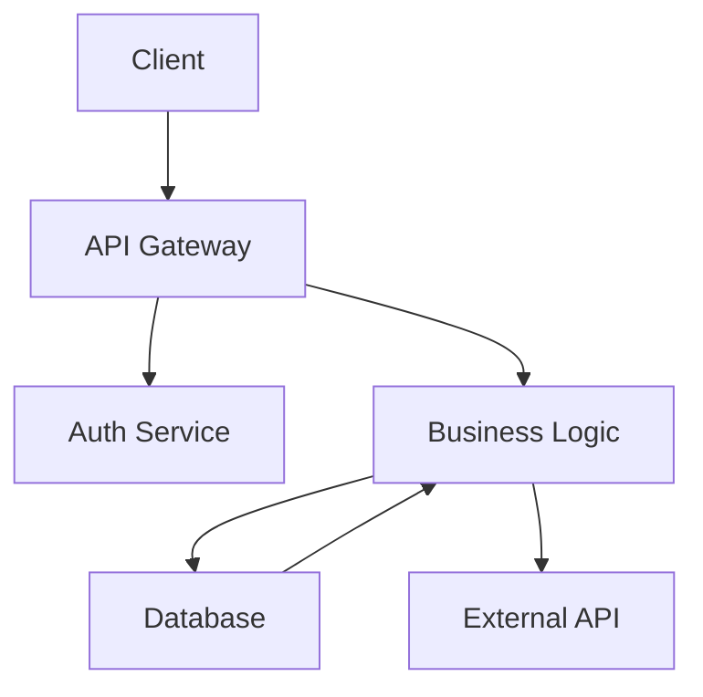


# How to Handle Hybrid Meeting Whiteboard Challenge with Digital and Physical Participants

Hybrid meetings present an unique challenge when visual collaboration tools like whiteboards are involved. You have participants in a physical room looking at a real whiteboard, while remote participants see something completely different through their screens. This asymmetry creates friction, reduces engagement, and often leaves remote team members at a disadvantage. Getting this right requires deliberate tooling choices, clear help protocols, and sometimes a complete rethinking of how visual collaboration happens.

This guide provides practical strategies for handling the hybrid whiteboard challenge, with specific examples tailored for developers and technical teams who need precise, efficient collaboration tools.

## The Core Problem: Two Different Experiences

In a typical hybrid whiteboard scenario, your in-room participants see a physical whiteboard or a large shared screen. They can point naturally, write with markers, and engage with the space intuitively. Remote participants, meanwhile, see a video feed that may be grainy, poorly framed, or delayed. They can't easily point at what they want to discuss, and their annotations may feel disconnected from what in-room participants are doing.

This creates a two-tier experience where some participants have full agency while others are reduced to passive observers. The solution isn't to eliminate physical whiteboards—many teams find them irreplaceable for certain types of thinking—but to create an unified experience that works for everyone.

## Strategy 1: Use Digital Whiteboard Tools as the Primary Canvas

The most straightforward approach is to abandon physical whiteboards entirely for hybrid sessions and use digital alternatives exclusively. Tools like Miro, FigJam, MURAL, or Microsoft Whiteboard give every participant an identical view and equal ability to contribute.

For developers, this often works well because these tools integrate with workflows you're already using. Here's a sample meeting setup script for initializing a collaborative digital whiteboard:

```javascript
// Example: Automating whiteboard session setup with Miro API
const miro = require('miro-api');

async function createTeamWhiteboard(sessionTitle, participants) {
  const board = await miro.board.create({
    name: sessionTitle,
    description: `Collaborative session - ${new Date().toDateString()}`
  });
  
  // Add standard templates for common meeting types
  await board.addWidget('shape', {
    x: 0,
    y: 0,
    width: 800,
    height: 200,
    content: 'Agenda items will go here'
  });
  
  // Share with participants
  for (const email of participants) {
    await board.invite(email, 'editor');
  }
  
  return board.viewLink;
}
```

This approach ensures everyone starts with the same view and can contribute equally. The main downside is losing the tactile quality of physical whiteboards, which some teams find valuable for brainstorming sessions.

## Strategy 2: Mirror Physical Whiteboards Digitally

If your team values physical whiteboards, you can create a hybrid system where a document camera or dedicated whiteboard camera feeds live video to remote participants, while a digital whiteboard tool runs in parallel for remote annotations.

Equipment setup for this strategy typically includes:

- A document camera (like IPEVO VZ-R) pointed at the physical whiteboard
- A wide-angle room camera for participant visibility
- A laptop running both the video feed and a digital whiteboard app
- Good lighting on the physical whiteboard to ensure readability

The help protocol matters more than the equipment. When someone in the room points at the physical whiteboard, they should simultaneously describe what they're pointing at for remote participants. When remote participants annotate on the digital whiteboard, someone in the room needs to read those annotations aloud.

Here's a help template you can use:

```
## Hybrid Whiteboard Session Protocol

### Starting the Session
1. Confirm remote participants can see the physical whiteboard clearly
2. Test audio levels - in-room mic should pick up everyone
3. Assign a "digital scribe" role to one remote participant
4. Explain: "When I point at the board, I'll describe what I'm referring to"

### During Discussion
- In-room: "I'm pointing at the top-left section where we outlined the API design"
- Remote: Use chat to flag important moments, type annotations to the digital board
- Scribe: Summarize key decisions in both physical and digital formats

### Ending the Session
- Photograph the physical whiteboard from multiple angles
- Export the digital whiteboard immediately
- Post both to your team wiki or shared folder
- Send summary within 1 hour while context is fresh
```

## Strategy 3: Switch Between Modalities

Some meetings don't need a whiteboard throughout. A practical approach is to alternate between modes based on the current activity:

- Discussion phases: Everyone on video, no whiteboard
- Brainstorming phases: Switch to digital whiteboard
- Synthesis phases: Physical whiteboard for quick diagramming
- Decision phases: Digital whiteboard for voting and documentation

This switching approach respects that different collaboration modes suit different tasks. It also gives remote participants predictable moments when their contribution tools will be most effective.

For technical teams, this might look like:

1. **Problem definition** (5 min): Video discussion
2. **Architecture sketching** (20 min): Digital whiteboard with everyone contributing
3. **Code walkthrough** (15 min): Screen share with code-focused discussion
4. **Action items** (5 min): Physical whiteboard for quick capture, photo shared afterward

## Handling the Technical Details

Beyond strategy, the technical execution determines whether your hybrid whiteboard sessions succeed or frustrate everyone.

### Camera Positioning

Place your whiteboard camera at an angle that minimizes shadows and ensures remote participants can read what's written. Test from the remote participant's perspective—can they read the smallest text? If not, write larger or invest in a better camera setup.

### Audio Considerations

This is often the overlooked factor. When participants discuss around a physical whiteboard, their voices bounce around the room. Remote participants may struggle to identify who's speaking or hear clearly through the echo. Consider:

- A directional microphone near the whiteboard area
- Acoustic panels to reduce echo in the room
- Requiring speakers to use lapel microphones or stay near the main mic

### Annotation Latency

If remote participants annotate on a digital whiteboard while in-room participants use a physical board, there's a synchronization problem. The solution is simple but requires discipline: the in-room "scribe" role must immediately transfer digital annotations to the physical board or vice versa. Don't let the two canvases diverge.

## Practical Tools for Developer Teams

For technical teams specifically, consider these tooling approaches:

**Code-first diagramming tools** like Mermaid or Excalidraw work well because they generate diagrams from text. Everyone can contribute via code comments, and the rendered output appears instantly on the shared canvas:



This approach is particularly powerful because diagrams become version-controllable and discussion happens in code review style rather than real-time annotation battles.

**GitHub Projects or Linear** with integrated whiteboarding features work for teams already living in these tools. The advantage is keeping design discussions in the same space where implementation happens.

## Measuring Success

Track these metrics to improve your hybrid whiteboard sessions:

- Participation parity: Are remote and in-room participants contributing equally?
- Follow-up clarity: Do post-meeting summaries accurately capture whiteboard content?
- Time to consensus: Are decisions being made efficiently, or does the hybrid format create confusion?
- Participant satisfaction: Survey both remote and in-room participants after key sessions

## Common Mistakes to Avoid

Teams often struggle with hybrid whiteboard sessions because they:

- Equip the room poorly: A laptop webcam pointed at a whiteboard rarely works
- Don't assign roles: Without explicit assignments, no one manages the hybrid experience
- Forget remote perspective: What seems obvious in the room is often invisible remotely
- Mix modalities without protocol: Trying to use both physical and digital whiteboards without clear rules creates chaos
- Skip documentation: Whiteboard content disappears within days without intentional capture

## Related Reading

- [Remote Work Guides Hub](/remote-work-tools/guides-hub/)
- [Hybrid Meeting Equity Tips for Remote Participants](/remote-work-tools/hybrid-meeting-equity-tips-for-remote-participants/)
- [Best Practice for Hybrid Team Meeting Scheduling.](/remote-work-tools/best-practice-for-hybrid-team-meeting-scheduling-respecting-/)
- [Best Practice for Hybrid Team All Hands Meeting with.](/remote-work-tools/best-practice-for-hybrid-team-all-hands-meeting-with-mixed-i/)

Built by

Built by theluckystrike — More at [zovo.one](https://zovo.one)

