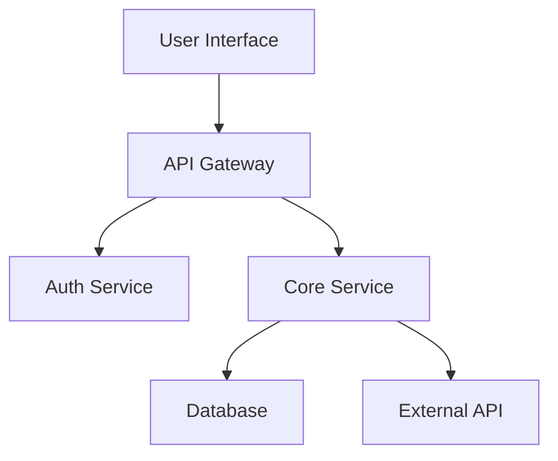


# How to Handle Knowledge Base Handoff When Remote Developer Leaves

When a remote developer leaves your team, the knowledge they've accumulated over months or years can feel like it's walking out the door with them. Unlike office environments where informal conversations fill knowledge gaps, remote work relies heavily on explicit documentation. This guide provides a practical framework for managing knowledge base handoff that preserves institutional knowledge and ensures continuity.

## Start the Handoff Process Early

The most critical factor in successful knowledge handoff is timing. As soon as you know a developer is leaving, initiate the process. Ideally, provide two to three weeks for knowledge transfer. Rushed handoffs result in gaps that surface as production issues weeks later.

Begin with a knowledge audit. Work with the departing developer to identify:

- Systems they exclusively maintain
- Architectural decisions they made
- External vendor relationships they manage
- Historical context not captured in documentation
- Ongoing projects requiring domain knowledge

Create a prioritized list based on business impact. Critical systems that only one person understands demand immediate attention.

## Documenting Technical Knowledge

Technical knowledge falls into two categories: current state documentation and historical context. Both matter, but teams often focus on the former while ignoring the why behind decisions.

### System Architecture Documentation

For each system the departing developer worked on, gather or create architecture diagrams. Use tools like Mermaid or draw.io to capture:



Beyond diagrams, document the deployment process, configuration requirements, and monitoring setup. Include answers to questions like: What happens when this service goes down? How do you diagnose performance issues? What are the key metrics to watch?

### Codebase Knowledge

Identify areas of the codebase where the departing developer has unique expertise. Request walkthroughs of complex modules, focusing on:

- Business logic that isn't obvious from reading code
- Edge cases and how they're handled
- Dependencies and integration points
- Technical debt and known issues

Record these sessions. Screen recordings with audio commentary become invaluable references for future developers.

## Creating a Handoff Document

A structured handoff document ensures nothing falls through the cracks. Here's a template you can adapt:

```markdown
# Developer Handoff Document
## [Developer Name] - Last Day: [Date]

### Systems Owned
| System | Criticality | Documentation Status |
|--------|-------------|---------------------|
| Payment API | Critical | Complete |
| User Dashboard | High | Needs Update |

### Key Contacts
- **Vendor API**: [Name] - vendor support line
- **Infrastructure**: [Name] - AWS account access

### Running Processes
1. Q2 infrastructure migration - 60% complete
2. Bug bash scheduled for [date]

### Access and Credentials
- [ ] AWS console access transferred
- [ ] GitHub repository permissions updated
- [ ] CI/CD pipeline access revoked
- [ ] VPN credentials disabled

### Unresolved Issues
- Known bug in search: workaround documented in JIRA-1234
- Performance issue under high load: see Slack thread

### Historical Context
Why we chose PostgreSQL over MongoDB: [explanation]
Decision to refactor auth in 2024: [explanation]
```

## Transferring Institutional Knowledge

Technical documentation captures what systems do, but institutional knowledge covers how your team works. This context often exists only in people's heads.

### Decision History

Create lightweight documentation of significant technical decisions. For each major choice, record:

- The problem being solved
- Options considered
- Why the chosen approach was selected
- Any trade-offs acknowledged

This prevents repeating mistakes and helps new team members understand the reasoning behind current implementations.

### Process Knowledge

Document team-specific workflows that aren't in official docs:

- How to request production access
- Release cadence and process
- On-call escalation procedures
- Communication norms for urgent issues

### Relationship Knowledge

Remote developers often build relationships with external contacts. Note:

- Vendor account managers and their contact info
- Open source maintainers they interact with
- Internal stakeholders in other departments

## Using Knowledge Management Tools

Several tools help capture and preserve knowledge effectively.

Wikis and Documentation Sites: GitBook, Notion, or Confluence serve as centralized knowledge bases. Encourage developers to maintain living documents rather than static files.

Architecture Decision Records (ADRs): A lightweight practice for documenting technical decisions. Each ADR follows a standard format:

```markdown
# ADR-001: Use PostgreSQL for Primary Database

## Status
Accepted

## Context
We need a database for the core application that handles user data, transactions, and reporting.

## Decision
We will use PostgreSQL as our primary database.

## Consequences
- Pro: Strong ACID compliance for transactions
- Pro: Excellent JSON support for flexible schemas
- Con: Requires more setup than SQLite
- Con: Horizontal scaling requires more effort
```

Video Documentation: Loom and similar tools enable quick video walkthroughs. A 10-minute screen recording explaining a complex process often communicates more than pages of written documentation.

## Post-Departure Validation

After a developer leaves, verify your knowledge base actually works. Assign someone to:

- Attempt to deploy each system they owned
- Answer questions a user might ask about their features
- Handle common issues that would have gone to the departed developer

This validation catches gaps while they're fixable. Create a feedback loop where the person covering these responsibilities documents what was missing.

## Building a Culture of Documentation

The best handoff is one that's unnecessary because knowledge was captured incrementally. Encourage documentation as part of daily work:

- Code reviews should verify documentation updates
- Feature work includes updating relevant docs
- Retroactive documentation happens when knowledge gaps appear

Remote teams must be intentional about knowledge sharing. Without hallway conversations, explicit documentation becomes the primary knowledge transfer mechanism.

## Knowledge Transfer Tools Comparison

Selecting the right tool stack determines whether knowledge actually gets preserved or sits unused. Here's how established teams compare their options:

| Tool | Cost | Best For | Documentation Style |
|------|------|----------|---------------------|
| Notion | Free-$8/person | Central knowledge hub | Structured pages with templates |
| Confluence | $5-8/person | Enterprise scaling | Wiki with version history |
| GitBook | Free-$15/seat | Technical documentation | Living markdown docs |
| Linear Docs | $10-15/month | Engineering teams | Linked to issues; code-first |
| Slite | $4-5/person | Quick team wikis | Simple, searchable knowledge |

**Notion works best** for cross-functional teams where knowledge includes design specs, architecture diagrams, and process docs. The template system prevents documentation inconsistency. However, Notion's search deteriorates with scale (50,000+ pages).

**Confluence dominates enterprise** because it enforces hierarchy and permissions. If you have compliance requirements or need to restrict who accesses infrastructure knowledge, Confluence's access controls matter. Cost scales with headcount.

**GitBook excels for developer-centric knowledge** where documentation lives alongside code. If your departing developer maintained internal libraries or CLI tools, GitBook's code block support and version control integration keep docs fresh.

## Screen Recording Best Practices for Knowledge Handoff

Video walkthroughs transfer knowledge faster than written documentation in many cases. Recording 5-10 minute screencasts of complex processes creates lasting reference material.

**Tools for recording:**
- **Loom** ($5-20/month) - frames your video, includes transcription, embeds in docs
- **OBS Studio** (free) - powerful for technical teams, steep learning curve
- **ScreenFlow** (macOS, $129) - professional quality, one-time cost
- **CloudApp** ($8/month) - lightweight, quick sharing

**Recording guidelines:**
1. **Script the walkthrough** - rambling videos waste viewers' time. Write a 2-minute script beforehand.
2. **Use your slowest tool interaction speed** - if you normally work fast, slow down 30% on camera.
3. **Narrate decisions, not actions** - viewers don't care that you clicked Save; they care why you used approach X instead of Y.
4. **Capture error states** - show what goes wrong and how to recover. Production issues surface when things fail.
5. **Title by outcome** - "Deploying Production API" not "Sarah's Random Walkthrough." Searchability matters six months later.

Example structure for a 5-minute walkthrough on database migration:

```
[0-30s] Problem intro: Why we needed to migrate from MongoDB to PostgreSQL
[30-90s] Architecture diagram showing old vs new system
[90-180s] Walkthrough of migration script with annotations
[180-240s] Troubleshooting common issues (replication lag, index creation)
[240-300s] Monitoring and validation after migration complete
```

## Advanced Handoff Documentation: Runbooks

A runbook is a script for handling recurring operational tasks. Unlike general documentation, runbooks format tasks as step-by-step procedures that anyone can follow.

Runbooks work best for high-stakes, low-frequency tasks that must be executed correctly. Database failover, security incident response, and production deployments are good candidates.

Example runbook structure for a payment system outage:

```markdown
# RUNBOOK: Payment Service Outage Response

## Severity: Critical

## Trigger Conditions
- Payment success rate drops below 95% for 5+ minutes
- Payment processing latency exceeds 10 seconds
- Customer complaints arrive faster than 10/minute in Slack

## Pre-Steps (Do these before escalating)
1. Check Datadog dashboard: /links/payment-system-health
2. Query last 100 failed transactions: `SELECT * FROM payment_errors LIMIT 100`
3. Check for recent deployments: `git log --oneline origin/main -10`

## If Database Connection Timeout
1. SSH to payment-db-primary
2. Run: `show processlist` to check active connections
3. If >800 connections, kill idle: `KILL QUERY <process_id>`

## If Service Unavailable
1. Check deployment status: `kubectl get deployment payment-api`
2. If pods stuck terminating, force: `kubectl delete pod <pod-name> --grace-period=0 --force`

## Escalation
Call on-call engineer: ${ONCALL_ENGINEER_PHONE}
```

Runbooks reduce decision-making during high-stress situations. The departing developer's knowledge, encoded as a procedure, becomes executable by their replacement.

## Knowledge Audit Template

Before the handoff meeting with the departing developer, use this template to ensure nothing gets missed:

```markdown
# Knowledge Audit: [Developer Name]

## Critical Path Systems (Will cause revenue impact if down)
- [ ] System: [Name]
  - Owner: [Developer Name]
  - Backup: [Assigned to]
  - Monitoring dashboard: [URL]
  - Escalation contact: [Name/Phone]

## High Maintenance Systems (Frequent operational overhead)
- [ ] System: [Name]
  - Frequency of intervention: [Daily/Weekly/Monthly]
  - Common issues: [List]
  - Typical resolution time: [X minutes]

## Knowledge Held by One Person Only
- [ ] Technical area: [Name]
  - Why only one person? [Decision context]
  - Documented where? [URL]
  - Can be owned by: [Name] (starting date)

## External Dependencies (Vendor relationships, API keys)
- [ ] Service: [Name]
  - Account owner: [Developer Name]
  - Key contact: [Vendor name/email]
  - Auth method: [OAuth/API key/...]
  - Renewal date: [Date]

## Recent Decision Making
- [ ] Major decision: [What changed]
  - Made by: [Developer Name]
  - Decision record: [URL to ADR or Slack thread]
  - Outcome: [Did it work]
```

Complete this audit collaboratively with the departing developer. Their input on what matters most prevents you from over-documenting low-stakes areas.

## Measuring Handoff Success: 30-60-90 Days

Don't assume the handoff worked just because the developer left. Measure success through a structured follow-up process:

**Day 30**: The replacement developer can answer basic questions about the systems without consulting external resources.

**Day 60**: The replacement has made at least one independent decision in the domain (bug fix, minor feature, infrastructure adjustment) that didn't require approval from other senior engineers.

**Day 90**: The replacement is confident enough to handle that domain solo during on-call shifts.

If you don't hit these milestones, schedule additional mentoring sessions or pair programming. It's far cheaper than having two people context-switching back to the old developer's systems.

## Building Preventive Documentation Practices

The best handoff is one that's unnecessary because knowledge was captured continuously:

1. **Documentation as part of definition of done** - code reviews shouldn't approve features without corresponding doc updates
2. **"Decision records" on major choices** - commit ADRs to version control, not buried in email
3. **Public status pages for systems** - everyone can see what each system does, who maintains it, and current health
4. **Quarterly knowledge audits** - every 90 days, ask "could someone else run this system if I left tomorrow?"
5. **Pair programming on critical paths** - rotate pairing so knowledge spreads, not concentrates

These practices compound over time. After six months of continuous documentation, handoffs become friction-free because knowledge was never siloed.


## Related Articles

- [Best Tools for Remote Team Knowledge Base 2026](/remote-work-tools/best-tools-for-remote-team-knowledge-base-2026/)
- [How to Create a Client-Facing Knowledge Base for a Remote](/remote-work-tools/how-to-create-client-facing-knowledge-base-for-remote-agency/)
- [Remote Team Knowledge Base Contribution Guidelines Template](/remote-work-tools/remote-team-knowledge-base-contribution-guidelines-template-/)
- [Remote Team Knowledge Base Contribution Incentive Program](/remote-work-tools/remote-team-knowledge-base-contribution-incentive-program-fo/)
- [Slite vs Notion for Team Knowledge Base](/remote-work-tools/slite-vs-notion-for-team-knowledge-base/)

Built by theluckystrike — More at [zovo.one](https://zovo.one)

