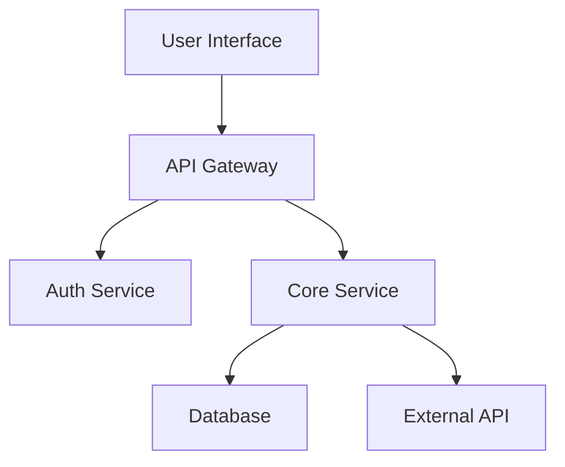


# How to Handle Knowledge Base Handoff When Remote Developer Leaves

When a remote developer leaves your team, the knowledge they've accumulated over months or years can feel like it's walking out the door with them. Unlike office environments where informal conversations fill knowledge gaps, remote work relies heavily on explicit documentation. This guide provides a practical framework for managing knowledge base handoff that preserves institutional knowledge and ensures continuity.

## Start the Handoff Process Early

The most critical factor in successful knowledge handoff is timing. As soon as you know a developer is leaving, initiate the process. Ideally, provide two to three weeks for knowledge transfer. Rushed handoffs result in gaps that surface as production issues weeks later.

Begin with a knowledge audit. Work with the departing developer to identify:

- Systems they exclusively maintain
- Architectural decisions they made
- External vendor relationships they manage
- Historical context not captured in documentation
- Ongoing projects requiring domain knowledge

Create a prioritized list based on business impact. Critical systems that only one person understands demand immediate attention.

## Documenting Technical Knowledge

Technical knowledge falls into two categories: current state documentation and historical context. Both matter, but teams often focus on the former while ignoring the why behind decisions.

### System Architecture Documentation

For each system the departing developer worked on, gather or create architecture diagrams. Use tools like Mermaid or draw.io to capture:



Beyond diagrams, document the deployment process, configuration requirements, and monitoring setup. Include answers to questions like: What happens when this service goes down? How do you diagnose performance issues? What are the key metrics to watch?

### Codebase Knowledge

Identify areas of the codebase where the departing developer has unique expertise. Request walkthroughs of complex modules, focusing on:

- Business logic that isn't obvious from reading code
- Edge cases and how they're handled
- Dependencies and integration points
- Technical debt and known issues

Record these sessions. Screen recordings with audio commentary become invaluable references for future developers.

## Creating a Handoff Document

A structured handoff document ensures nothing falls through the cracks. Here's a template you can adapt:

```markdown
# Developer Handoff Document
## [Developer Name] - Last Day: [Date]

### Systems Owned
| System | Criticality | Documentation Status |
|--------|-------------|---------------------|
| Payment API | Critical | Complete |
| User Dashboard | High | Needs Update |

### Key Contacts
- **Vendor API**: [Name] - vendor support line
- **Infrastructure**: [Name] - AWS account access

### Running Processes
1. Q2 infrastructure migration - 60% complete
2. Bug bash scheduled for [date]

### Access and Credentials
- [ ] AWS console access transferred
- [ ] GitHub repository permissions updated
- [ ] CI/CD pipeline access revoked
- [ ] VPN credentials disabled

### Unresolved Issues
- Known bug in search: workaround documented in JIRA-1234
- Performance issue under high load: see Slack thread

### Historical Context
Why we chose PostgreSQL over MongoDB: [explanation]
Decision to refactor auth in 2024: [explanation]
```

## Transferring Institutional Knowledge

Technical documentation captures what systems do, but institutional knowledge covers how your team works. This context often exists only in people's heads.

### Decision History

Create lightweight documentation of significant technical decisions. For each major choice, record:

- The problem being solved
- Options considered
- Why the chosen approach was selected
- Any trade-offs acknowledged

This prevents repeating mistakes and helps new team members understand the reasoning behind current implementations.

### Process Knowledge

Document team-specific workflows that aren't in official docs:

- How to request production access
- Release cadence and process
- On-call escalation procedures
- Communication norms for urgent issues

### Relationship Knowledge

Remote developers often build relationships with external contacts. Note:

- Vendor account managers and their contact info
- Open source maintainers they interact with
- Internal stakeholders in other departments

## Using Knowledge Management Tools

Several tools help capture and preserve knowledge effectively.

Wikis and Documentation Sites: GitBook, Notion, or Confluence serve as centralized knowledge bases. Encourage developers to maintain living documents rather than static files.

Architecture Decision Records (ADRs): A lightweight practice for documenting technical decisions. Each ADR follows a standard format:

```markdown
# ADR-001: Use PostgreSQL for Primary Database

## Status
Accepted

## Context
We need a database for the core application that handles user data, transactions, and reporting.

## Decision
We will use PostgreSQL as our primary database.

## Consequences
- Pro: Strong ACID compliance for transactions
- Pro: Excellent JSON support for flexible schemas
- Con: Requires more setup than SQLite
- Con: Horizontal scaling requires more effort
```

Video Documentation: Loom and similar tools enable quick video walkthroughs. A 10-minute screen recording explaining a complex process often communicates more than pages of written documentation.

## Post-Departure Validation

After a developer leaves, verify your knowledge base actually works. Assign someone to:

- Attempt to deploy each system they owned
- Answer questions an user might ask about their features
- Handle common issues that would have gone to the departed developer

This validation catches gaps while they're fixable. Create a feedback loop where the person covering these responsibilities documents what was missing.

## Building a Culture of Documentation

The best handoff is one that's unnecessary because knowledge was captured incrementally. Encourage documentation as part of daily work:

- Code reviews should verify documentation updates
- Feature work includes updating relevant docs
- Retroactive documentation happens when knowledge gaps appear

Remote teams must be intentional about knowledge sharing. Without hallway conversations, explicit documentation becomes the primary knowledge transfer mechanism.


## Related Reading

- [Remote Work Guides Hub](/remote-work-tools/guides-hub/)
- [Remote Team Knowledge Base Contribution Guidelines Template](/remote-work-tools/remote-team-knowledge-base-contribution-guidelines-template-/)
- [How to Prevent Knowledge Silos When Remote Team Grows.](/remote-work-tools/how-to-prevent-knowledge-silos-when-remote-team-grows-past-25-engineers/)
- [Remote Team Knowledge Base Contribution Incentive.](/remote-work-tools/remote-team-knowledge-base-contribution-incentive-program-fo/)

Built by

Built by theluckystrike — More at [zovo.one](https://zovo.one)

