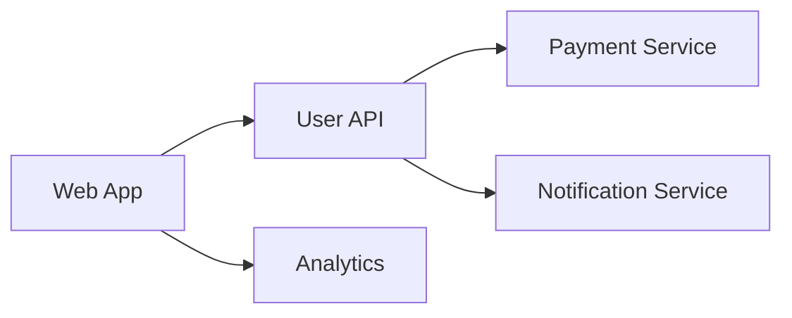

# How to Track Project Dependencies in a Remote Team: A Practical Guide

Track project dependencies in a remote team by maintaining a central YAML dependency registry that maps inter-service relationships and ownership, generating dependency graphs with tools like dependency-cruiser or Nx, and automating updates with Dependabot or Renovate. Pair these with a PR template requiring dependency change documentation and cross-team Slack notifications triggered when shared services change. This guide covers each method with concrete code examples you can implement immediately.

## Why Dependency Tracking Fails in Remote Teams

Remote work amplifies dependency management challenges that already exist in software development. When developers sit in the same office, informal conversations surface hidden dependencies—"Hey, are you using that authentication module I wrote?" happens naturally. In distributed teams, these conversations require deliberate effort.

The core problems are visibility and timing. You may not know another team is depending on an API you're about to change. Even when you do know, the timezone gap means they might be asleep when you deploy a breaking change. Effective dependency tracking addresses both: making dependencies visible and creating safe communication channels.

## Start with Your Package Manager

The foundation of dependency tracking begins with your package manager configuration. Whether you use npm, pip, Cargo, or Go modules, your dependency files already contain valuable information— you just need to expose it.

For npm projects, generate a dependency tree regularly:

```bash
# List all dependencies with versions
npm ls --all

# Output to a file for team review
npm ls --all > dependency-tree.txt
```

For Python projects, use pip-tools to freeze and audit dependencies:

```bash
pip freeze > requirements.txt
pip-audit  # Check for vulnerabilities
```

Commit these dependency snapshots to your repository. When you review a pull request, you can compare the new dependency tree against the baseline. This catches unexpected additions early.

## Create a Central Dependency Registry

For projects with multiple services or packages, maintain a central registry that maps dependencies between components. This doesn't require complex tooling—a simple YAML or JSON file works well:

```yaml
# dependency-registry.yaml
services:
  - name: user-api
    owner: team-backend
    dependencies:
      - payment-service
      - notification-service
    internal_apis:
      - provides: /api/users
        consumed_by: [web-app, mobile-app, analytics-worker]

  - name: payment-service
    owner: team-payments
    dependencies:
      - stripe-api
      - webhook-handler

  - name: web-app
    owner: team-frontend
    dependencies:
      - user-api
      - analytics-service
```

Place this file in a shared location—your repository root, an internal wiki, or a dedicated docs folder. Update it whenever you add or remove inter-service dependencies. The registry becomes a single source of truth for understanding system architecture.

## Use Dependency Graphs and Visualization

Visual representations of dependencies help teams understand relationships at a glance. Several tools can generate these automatically.

**Mermaid diagrams** render directly in GitHub/GitLab markdown:



For JavaScript/TypeScript projects, **dependency-cruiser** generates detailed reports:

```bash
npm install --save-dev dependency-cruiser
npx dependency-cruiser --output-type html > dependency-report.html
```

For monorepos, **Nx** provides built-in dependency visualization:

```bash
npx nx graph
```

Run these tools in your CI pipeline and fail builds when critical dependencies change. This automation catches problems before they reach production.

## Automate Dependency Updates with Bots

Keeping dependencies current reduces security vulnerabilities and compatibility issues. Set up automated dependabot-style workflows:

```yaml
# .github/dependabot.yml
version: 2
updates:
  - package-ecosystem: "npm"
    directory: "/"
    schedule:
      interval: "weekly"
    labels:
      - "dependencies"
    reviewers:
      - team-backend
```

For GitHub Actions, use **Dependabot** to automatically create pull requests for outdated dependencies. Configure it to notify specific team members based on which packages change.

Beyond GitHub, **Renovate** offers more flexible configuration for monorepos and complex dependency trees:

```json
// renovate.json
{
  "extends": ["config:base"],
  "packageRules": [{
    "matchPackagePatterns": ["*"],
    "matchUpdateTypes": ["minor", "patch"],
    "automerge": true,
    "requiredStatusChecks": ["test"]
  }]
}
```

## Establish Communication Channels for Dependency Changes

Tools alone won't solve dependency management. You need processes that ensure changes propagate correctly across time zones.

**Create a dependency change template** for PR descriptions:

```markdown
## Dependency Changes

<!-- Fill this out for any PR that changes dependencies -->

### Added
- [ ] List new dependencies and why they're needed

### Removed
- [ ] List removed dependencies and impact

### Modified
- [ ] List version bumps and migration notes

### Internal API Changes
- [ ] Does this affect other teams' integrations?
- [ ] Have affected teams been notified?
- [ ] Migration timeline:

### Reviewed By
- [ ] Team member who reviewed dependency changes
```

Require teams to fill this out for any PR touching shared dependencies. This creates an audit trail and ensures communication happens before merging.

**Set up cross-team notifications** using Slack webhooks or similar tools. When a team modifies a service others depend on, the system should alert affected teams automatically:

```javascript
// notify-dependents.js
const webhookUrl = process.env.SLACK_WEBHOOK_URL;

async function notifyDependents(serviceName, changes) {
  const affectedTeams = findAffectedTeams(serviceName);

  for (const team of affectedTeams) {
    await fetch(webhookUrl, {
      method: 'POST',
      body: JSON.stringify({
        text: `⚠️ Dependency Alert: ${serviceName} changed`,
        attachments: [{
          color: 'warning',
          fields: [
            { title: 'Changes', value: changes.summary },
            { title: 'Action Required', value: changes.action_needed }
          ]
        }]
      })
    });
  }
}
```

## Monitor Dependencies in Production

Tracking dependencies isn't complete without observability. Monitor your applications for dependency-related failures:

```javascript
// metrics/dependency-health.js
const dependencyMetrics = {
  // Track external API health
  trackExternalDependency: (name, status, latency) => {
    metrics.increment(`dependency.${name}.calls`);
    metrics.gauge(`dependency.${name}.latency`, latency);

    if (status >= 500) {
      metrics.increment(`dependency.${name}.errors`);
      alert.onCall.notify(`External dependency ${name} is failing`);
    }
  },

  // Track internal service dependencies
  trackInternalDependency: (service, endpoint, status) => {
    metrics.increment(`internal_dep.${service}.${endpoint}.${status}`);
  }
};
```

Set up alerts for dependency failures with escalation paths. When a payment API goes down, the team on-call should know immediately—regardless of which timezone they're in.

## Build a Dependency Review Habit

The most effective remote teams make dependency review a regular practice:

Run a weekly dependency audit — 30 minutes reviewing changes from the past week is enough. Hold monthly architecture reviews to update the registry and identify growing coupling. Every quarter, remove unused dependencies and work through major version updates before they pile up.

Document these sessions. Future team members will thank you.

## Putting It Together

Make dependency visibility part of the daily workflow rather than a periodic exercise. When any developer can answer "what does this service depend on?" in under a minute, the team ships faster and breaks less.


## Related Articles

- [How to Track Remote Team Hiring Pipeline Velocity](/remote-work-tools/how-to-track-remote-team-hiring-pipeline-velocity-for-distri/)
- [How to Track Remote Team Use Rate Without Invasive](/remote-work-tools/how-to-track-remote-team-utilization-rate-without-invasive-monitoring-tools/)
- [How to Track Remote Team Velocity Metrics](/remote-work-tools/how-to-track-remote-team-velocity-metrics/)
- [Remote Engineering Team Infrastructure Cost Per Deploy](/remote-work-tools/remote-engineering-team-infrastructure-cost-per-deploy-track/)
- [Best Practice for Remote Team Cross Functional Project](/remote-work-tools/best-practice-for-remote-team-cross-functional-project-kicko/)

Built by theluckystrike — More at [zovo.one](https://zovo.one)
