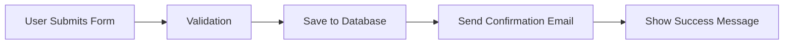


# Video Walkthrough Tools for Presenting Code Changes to Non-Technical Clients

Showing code changes to non-technical clients presents an unique communication challenge. Your client needs to understand what changed, why it matters, and how it affects their project—without getting lost in syntax, file structures, or developer jargon. Video walkthroughs bridge this gap by combining visual demonstration with verbal explanation, letting you control the narrative and pace.

This guide covers the tools and techniques you need to create effective video explanations of code changes for non-technical stakeholders.

## Why Video Walkthroughs Work Better Than Screenshots

Static screenshots capture a moment in time but fail to show process, interaction, or change over time. A client looking at a diff cannot easily understand what was added, removed, or modified without technical context. Video walkthroughs solve this by:

- Showing sequence: Clients see changes happen in order, following your logic
- Adding voice context: You explain intent while demonstrating implementation
- Highlighting key areas: Annotation tools draw attention to what matters
- Enabling playback: Clients can review explanations on their own schedule

## Essential Tools for Code Change Presentations

### 1. Screen Recording with Code Highlighting

Tools like **Loom** and **Screen Studio** provide quick screen capture with built-in editing. For code-specific recordings, consider:

- Raycast Screen Capture: Fast capture with simple editing, works well on macOS
- CleanShot X: Screenshot and recording tool with annotation features
- OBS Studio: Free, open-source option with scene composition

When recording code changes, use a syntax-highlighted theme that provides visual contrast. Dark themes with colorful syntax highlighting make code easier to read on video.

### 2. Git Visualization Tools

Static diffs confuse non-technical clients. These tools visualize changes more intuitively:

- GitGraph.js: Render git history as visual graphs
- GitHub's diff viewer: Use the rendered diff view for PR descriptions
- Mermaid diagrams: Include flow diagrams in your documentation

Here's an example of a Mermaid diagram showing a feature flow for client documentation:



### 3. Browser-Based Demonstration Platforms

For web projects, recording directly in the browser sometimes works better than system-level screen capture:

- Prequel: Browser-based screen recorder with editing
- Vercel Clip: Create shareable demos of web features
- Carrot: Quick browser recordings with simple sharing

## Creating Effective Code Walkthroughs

### Step 1: Prepare Your Environment

Before recording, set up your screen for clarity:

1. Increase font size: Code should be readable at 1080p
2. Use a focused theme: Remove distractions from your IDE
3. Prepare the starting point: Open the relevant files or PR
4. Test audio levels: Ensure your voice records clearly

### Step 2: Structure Your Presentation

Organize your walkaround with a clear beginning, middle, and end:

```
## Introduction (30 seconds)
- State the purpose of this change
- Mention the issue or feature being addressed

## Main Demonstration (2-4 minutes)
- Show the relevant code sections
- Explain what changed and why
- Highlight key implementation details

## Client-Facing Summary (30 seconds)
- Translate technical details to business impact
- Confirm what this means for their project
```

### Step 3: Add Annotations During Recording

Most screen recording tools let you draw or highlight during recording. Use these features to:

- Circle important buttons or links
- Draw arrows connecting related elements
- Type temporary labels for clarification

### Step 4: Edit for Clarity

After recording, trim unnecessary sections:

- Remove setup time before you start explaining
- Cut retakes or mistakes
- Add text overlays for important terms

## Practical Example: Presenting a Bug Fix

Imagine you fixed a login issue for a client. Here's how to present it effectively:

**Before recording, prepare:**
- Open the relevant authentication code
- Pull up the error logs showing the original issue
- Have the fixed behavior ready to demonstrate

**During the walkthrough:**

> "This video explains the login issue we resolved. Here's the original problem—the system was timing out after 30 seconds when users tried to reset their password. You can see the error in the logs here."
>
> [Show error logs with highlight]
>
> "The fix was straightforward. We updated the timeout setting in the authentication config. Here's the change—instead of 30 seconds, we now allow 2 minutes for password resets."
>
> [Show diff with highlight]
>
> "This means your users now have adequate time to complete the reset process without errors. The fix is deployed and we've tested it multiple times."
>
> [Show working demo]

This approach keeps technical details accessible while giving the client confidence that their issue was addressed.

## Tools Comparison at a Glance

| Tool | Best For | Cost | Platform |
|------|----------|------|----------|
| Loom | Quick async updates | Free tier available | Web, Mac, Windows |
| CleanShot X | macOS users wanting quality | One-time purchase | macOS only |
| OBS Studio | Custom layouts, live streaming | Free | Mac, Windows, Linux |
| Screen Studio | Polished AI-enhanced recordings | Subscription | macOS |

## Best Practices for Client Communication

1. Keep videos under 5 minutes: Attention spans are limited
2. Lead with the outcome: Tell clients what you fixed before showing how
3. Use plain language: Replace "we refactored the auth module" with "we improved the login system"
4. Provide context: Remind clients what the original request was
5. Offer follow-up: Invite questions if anything remains unclear

## Automating Documentation with Video Links

Store your walkthroughs alongside your code changes for future reference. In your PR descriptions, include video links:

```markdown
## Video Explanation
[Loom: Password reset fix walkthrough](https://loom.com/share/your-video-id)

## Changes Made
- Updated authentication timeout in config/auth.php
- Added unit tests for reset flow
- Verified fix on staging environment
```

This practice creates a searchable knowledge base of explanations your entire team can reference.

Video walkthroughs transform how you communicate code changes to non-technical clients. By combining visual demonstration with verbal explanation, you build trust and clarity without requiring your clients to understand code syntax. Start with simple screen recordings using tools like Loom or CleanShot X, add clear narration, and always explain the business impact alongside technical changes.


## Related Reading

- [Remote Work Guides Hub](/remote-work-tools/guides-hub/)
- [How to Present Sprint Demos to Non-Technical Remote Clients](/remote-work-tools/how-to-present-sprint-demos-to-non-technical-remote-clients/)
- [Remote Developer Code Review Workflow Tools for Teams.](/remote-work-tools/remote-developer-code-review-workflow-tools-for-teams-without-synchronous-overlap/)
- [How to Set Up Basecamp for Remote Agency Client.](/remote-work-tools/how-to-set-up-basecamp-for-remote-agency-client-communicatio/)

Built by

Built by theluckystrike — More at [zovo.one](https://zovo.one)

