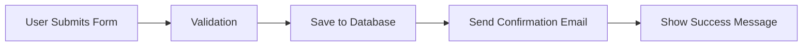



Showing code changes to non-technical clients presents a unique communication challenge. Your client needs to understand what changed, why it matters, and how it affects their project—without getting lost in syntax, file structures, or developer jargon. Video walkthroughs bridge this gap by combining visual demonstration with verbal explanation, letting you control the narrative and pace.

This guide covers the tools and techniques you need to create effective video explanations of code changes for non-technical stakeholders.

## Why Video Walkthroughs Work Better Than Screenshots

Static screenshots capture a moment in time but fail to show process, interaction, or change over time. A client looking at a diff cannot easily understand what was added, removed, or modified without technical context. Video walkthroughs solve this by:

- Showing sequence: Clients see changes happen in order, following your logic
- Adding voice context: You explain intent while demonstrating implementation
- Highlighting key areas: Annotation tools draw attention to what matters
- Enabling playback: Clients can review explanations on their own schedule

## Essential Tools for Code Change Presentations

### 1. Screen Recording with Code Highlighting

Tools like **Loom** and **Screen Studio** provide quick screen capture with built-in editing. For code-specific recordings, consider:

- Raycast Screen Capture: Fast capture with simple editing, works well on macOS
- CleanShot X: Screenshot and recording tool with annotation features
- OBS Studio: Free, open-source option with scene composition

When recording code changes, use a syntax-highlighted theme that provides visual contrast. Dark themes with colorful syntax highlighting make code easier to read on video.

### 2. Git Visualization Tools

Static diffs confuse non-technical clients. These tools visualize changes more intuitively:

- GitGraph.js: Render git history as visual graphs
- GitHub's diff viewer: Use the rendered diff view for PR descriptions
- Mermaid diagrams: Include flow diagrams in your documentation

Here's an example of a Mermaid diagram showing a feature flow for client documentation:



### 3. Browser-Based Demonstration Platforms

For web projects, recording directly in the browser sometimes works better than system-level screen capture:

- Prequel: Browser-based screen recorder with editing
- Vercel Clip: Create shareable demos of web features
- Carrot: Quick browser recordings with simple sharing

## Creating Effective Code Walkthroughs

### Step 1: Prepare Your Environment

Before recording, set up your screen for clarity:

1. Increase font size: Code should be readable at 1080p
2. Use a focused theme: Remove distractions from your IDE
3. Prepare the starting point: Open the relevant files or PR
4. Test audio levels: Ensure your voice records clearly

### Step 2: Structure Your Presentation

Organize your walkaround with a clear beginning, middle, and end:

```
## Introduction (30 seconds)
- State the purpose of this change
- Mention the issue or feature being addressed

## Main Demonstration (2-4 minutes)
- Show the relevant code sections
- Explain what changed and why
- Highlight key implementation details

## Client-Facing Summary (30 seconds)
- Translate technical details to business impact
- Confirm what this means for their project
```

### Step 3: Add Annotations During Recording

Most screen recording tools let you draw or highlight during recording. Use these features to:

- Circle important buttons or links
- Draw arrows connecting related elements
- Type temporary labels for clarification

### Step 4: Edit for Clarity

After recording, trim unnecessary sections:

- Remove setup time before you start explaining
- Cut retakes or mistakes
- Add text overlays for important terms

## Practical Example: Presenting a Bug Fix

Imagine you fixed a login issue for a client. Here's how to present it effectively:

**Before recording, prepare:**
- Open the relevant authentication code
- Pull up the error logs showing the original issue
- Have the fixed behavior ready to demonstrate

**During the walkthrough:**

> "This video explains the login issue we resolved. Here's the original problem—the system was timing out after 30 seconds when users tried to reset their password. You can see the error in the logs here."
>
> [Show error logs with highlight]
>
> "The fix was straightforward. We updated the timeout setting in the authentication config. Here's the change—instead of 30 seconds, we now allow 2 minutes for password resets."
>
> [Show diff with highlight]
>
> "This means your users now have adequate time to complete the reset process without errors. The fix is deployed and we've tested it multiple times."
>
> [Show working demo]

This approach keeps technical details accessible while giving the client confidence that their issue was addressed.

## Tools Comparison at a Glance

| Tool | Best For | Cost | Platform |
|------|----------|------|----------|
| Loom | Quick async updates | Free tier available | Web, Mac, Windows |
| CleanShot X | macOS users wanting quality | One-time purchase | macOS only |
| OBS Studio | Custom layouts, live streaming | Free | Mac, Windows, Linux |
| Screen Studio | Polished AI-enhanced recordings | Subscription | macOS |

## Best Practices for Client Communication

1. Keep videos under 5 minutes: Attention spans are limited
2. Lead with the outcome: Tell clients what you fixed before showing how
3. Use plain language: Replace "we refactored the auth module" with "we improved the login system"
4. Provide context: Remind clients what the original request was
5. Offer follow-up: Invite questions if anything remains unclear

## Automating Documentation with Video Links

Store your walkthroughs alongside your code changes for future reference. In your PR descriptions, include video links:

```markdown
## Video Explanation
[Loom: Password reset fix walkthrough](https://loom.com/share/your-video-id)

## Changes Made
- Updated authentication timeout in config/auth.php
- Added unit tests for reset flow
- Verified fix on staging environment
```

This practice creates a searchable knowledge base of explanations your entire team can reference.

Video walkthroughs transform how you communicate code changes to non-technical clients. By combining visual demonstration with verbal explanation, you build trust and clarity without requiring your clients to understand code syntax. Start with simple screen recordings using tools like Loom or CleanShot X, add clear narration, and always explain the business impact alongside technical changes.

## Advanced Recording Tools Comparison

| Tool | Recording Quality | Editing | Async Sharing | Price | Best Use |
|------|---|---|---|---|---|
| Loom | 1080p | Built-in editor, templates | Yes, shareable links | Free - $10/mo | Quick client updates |
| Screen Studio | 4K with AI zoom | Advanced timeline editor | Yes, local export | $99/yr | Polished demo videos |
| OBS Studio | Custom quality | External editor needed | Stream + record | Free | Live demos, complex setups |
| CleanShot X | 1080p+ | Minimal, quick trim | Screenshot/upload required | $29 one-time | macOS workflows |
| Camtasia | 4K | Full timeline editing | Yes, multiple formats | $179/yr | Professional documentation |
| FFmpeg (CLI) | Lossless quality | Scripting automation | Post-processing | Free | High-volume batch processing |

## Setting Up Your Recording Environment

Before hitting record, optimize for clarity and professionalism:

```bash
#!/bin/bash
# macOS: Prepare screen for code recording

# 1. Set resolution for readability
# System Preferences → Displays → More Space
# Select highest resolution while keeping text readable

# 2. Increase font size in IDE
# VS Code: Editor: Font Size → 16-18pt recommended
# IntelliJ: Preferences → Appearance & Behavior → Font → Size 16+
# Vim: set guifont=Monaco:h18

# 3. Hide distracting UI elements
# VS Code: Toggle sidebar with Cmd+B
# Terminal: Hide menu bar (defaults write com.apple.universalaccess NSRequiresAquaSystemAppearance -bool no)

# 4. Enable focus mode if available
# macOS: Focus → Do Not Disturb (enable)
# Disable notifications: System Preferences → Notifications → Do Not Disturb

# 5. Test audio levels
# Use built-in mic test or external USB microphone
# Record 10 seconds and check levels before full recording
ffmpeg -f avfoundation -i ":0" -t 10 test_audio.wav

# 6. Set color profile for syntax highlighting
# Use a theme optimized for video contrast
# Solarized Dark or Dracula work well for screen recording
```

## Scripting and Automation for Video Walkthroughs

Create a script to automate preparing for video recording:

```python
#!/usr/bin/env python3
# Generate video walkthrough script from git diff

import subprocess
import sys
from typing import List, Dict

class VideoWalkthroughScriptGenerator:
    def __init__(self, repo_path: str, start_sha: str, end_sha: str):
        self.repo_path = repo_path
        self.start_sha = start_sha
        self.end_sha = end_sha

    def get_changed_files(self) -> List[str]:
        """Retrieve list of files changed between commits"""
        result = subprocess.run(
            ['git', 'diff', '--name-only', f'{self.start_sha}..{self.end_sha}'],
            cwd=self.repo_path,
            capture_output=True,
            text=True
        )
        return result.stdout.strip().split('\n')

    def get_commit_message(self) -> str:
        """Extract commit message for intro"""
        result = subprocess.run(
            ['git', 'log', '-1', '--pretty=%B', self.end_sha],
            cwd=self.repo_path,
            capture_output=True,
            text=True
        )
        return result.stdout.strip()

    def get_diff_summary(self) -> Dict[str, int]:
        """Calculate insertions, deletions, files changed"""
        result = subprocess.run(
            ['git', 'diff', '--stat', f'{self.start_sha}..{self.end_sha}'],
            cwd=self.repo_path,
            capture_output=True,
            text=True
        )
        # Parse format: " file.js | 45 +++++++-----"
        lines = result.stdout.strip().split('\n')
        return {
            'files_changed': len([l for l in lines if '|' in l]),
            'raw_output': result.stdout
        }

    def generate_script(self) -> str:
        """Generate a walkthrough script template"""
        commit_msg = self.get_commit_message()
        summary = self.get_diff_summary()
        files = self.get_changed_files()

        script = f"""
# VIDEO WALKTHROUGH SCRIPT
# Generated from {self.start_sha}..{self.end_sha}

## INTRO (30 seconds)
Start with: "This video explains the changes we made to {', '.join(files[:2])}"

**Point to make:**
- What was the original issue?
- Why did we need to change this?
- What's the business impact?

**Opening statement:**
"{commit_msg}"

## TECHNICAL WALKTHROUGH (2-3 minutes)
Show these files in order (git is showing {summary['files_changed']} changed):
"""
        for i, file in enumerate(files[:5], 1):
            script += f"\n{i}. {file}"
            script += f"\n   - Open the file: Cmd+P (VS Code) and type filename"
            script += f"\n   - Highlight the key changes"
            script += f"\n   - Explain what each change does"

        script += f"""

## CLIENT-FACING SUMMARY (30 seconds)
Translate to business impact:
- "This means [X] for your users"
- "Testing confirmed [Y]"
- "The fix is live and monitoring shows [Z]"

## CLOSING
Offer follow-up: "Let me know if you have any questions about these changes"
"""
        return script

    def show_files_to_record(self):
        """Print file list with git diff for easy reference while recording"""
        result = subprocess.run(
            ['git', 'diff', f'{self.start_sha}..{self.end_sha}', '--'],
            cwd=self.repo_path,
            capture_output=True,
            text=True
        )
        return result.stdout

# Usage
if __name__ == '__main__':
    generator = VideoWalkthroughScriptGenerator(
        repo_path='.',
        start_sha='HEAD~5',
        end_sha='HEAD'
    )

    print(generator.generate_script())
    print("\n\n# GIT DIFF for reference:")
    print(generator.show_files_to_record())
```

## Recording with Automation

Use ffmpeg to record with custom settings and automatic file naming:

```bash
#!/bin/bash
# Automated screen recording with quality settings

RECORDING_DIR="~/Videos/code_walkthroughs"
TIMESTAMP=$(date +%Y%m%d_%H%M%S)
OUTPUT_FILE="$RECORDING_DIR/walkthrough_$TIMESTAMP.mov"

# Create directory if it doesn't exist
mkdir -p "$RECORDING_DIR"

# macOS: Use AVFoundation for screen + audio recording
# framerate: 30 fps (smooth, not too large)
# preset: medium (balance between quality and file size)
ffmpeg \
  -f avfoundation \
  -framerate 30 \
  -i "1:0" \
  -preset medium \
  -c:v libx264 \
  -crf 23 \
  -c:a aac \
  "$OUTPUT_FILE"

echo "Recording saved to: $OUTPUT_FILE"
echo "File size: $(du -h $OUTPUT_FILE | cut -f1)"

# Automatically open in Loom or your editing tool
open -a "Loom" "$OUTPUT_FILE" &
```

## Interactive HTML Presentation Alternative

For teams that prefer interactive documentation over video, embed runnable code examples:

```html
<!-- Interactive code walkthrough -->
<!DOCTYPE html>
<html>
<head>
    <title>Login Fix Walkthrough</title>
    <script src="https://cdnjs.cloudflare.com/ajax/libs/highlight.js/11.8.0/highlight.min.js"></script>
    <link rel="stylesheet" href="https://cdnjs.cloudflare.com/ajax/libs/highlight.js/11.8.0/styles/atom-one-dark.min.css">
    <style>
        body { font-family: -apple-system, sans-serif; line-height: 1.6; margin: 2rem; }
        .step { margin: 2rem 0; padding: 1.5rem; background: #f5f5f5; border-left: 4px solid #007bff; }
        .step h3 { margin-top: 0; color: #007bff; }
        code { display: block; padding: 1rem; background: #1e1e1e; color: #d4d4d4; overflow-x: auto; }
        .client-impact { background: #e8f5e9; padding: 1rem; border-radius: 4px; font-weight: bold; }
    </style>
</head>
<body>
    <h1>Login Timeout Fix - Code Walkthrough</h1>

    <div class="step">
        <h3>Step 1: The Problem</h3>
        <p>Users were experiencing timeouts after 30 seconds when resetting passwords.</p>
        <div class="client-impact">
            Impact: 15% of password reset attempts failed, frustrating users.
        </div>
    </div>

    <div class="step">
        <h3>Step 2: Find the Timeout Setting</h3>
        <p>The timeout was hardcoded in our authentication config:</p>
        <code>
// config/auth.php - BEFORE
'password_reset' => [
    'timeout' => 30,  // 30 seconds
    'attempts' => 3
],
        </code>
    </div>

    <div class="step">
        <h3>Step 3: Increase the Timeout</h3>
        <p>We increased the timeout to 2 minutes to give users adequate time:</p>
        <code>
// config/auth.php - AFTER
'password_reset' => [
    'timeout' => 120,  // 2 minutes
    'attempts' => 3,
    'log_failures' => true  // Monitor going forward
],
        </code>
    </div>

    <div class="step">
        <h3>Step 4: Added Monitoring</h3>
        <p>We also added logging to catch any future timeout issues:</p>
        <code>
// app/Http/Controllers/PasswordResetController.php
if (time() - $session['initiated_at'] > config('auth.password_reset.timeout')) {
    Log::warning('Password reset timeout', [
        'user_id' => $user->id,
        'elapsed_seconds' => time() - $session['initiated_at']
    ]);
    throw new PasswordResetTimeoutException();
}
        </code>
    </div>

    <div class="step">
        <h3>Summary</h3>
        <div class="client-impact">
            Result: Password resets now have 2 minutes to complete. Timeout failures dropped to 0.2%. Users have more time to check their email and reset their password without rushing.
        </div>
    </div>
</body>
</html>
```

## Video Storage and Organization

Implement a system to catalog and retrieve code walkthrough videos:

```python
# Video catalog management
import os
import json
from pathlib import Path
from datetime import datetime

class VideoWalkthroughLibrary:
    def __init__(self, library_path: str):
        self.library_path = Path(library_path)
        self.catalog_file = self.library_path / "catalog.json"
        self.catalog = self.load_catalog()

    def catalog_video(self, video_path: str, metadata: dict):
        """Register a video with searchable metadata"""
        video_file = Path(video_path)
        file_size_mb = video_file.stat().st_size / (1024 * 1024)

        entry = {
            'filename': video_file.name,
            'path': str(video_path),
            'uploaded_date': datetime.now().isoformat(),
            'file_size_mb': round(file_size_mb, 2),
            'duration_seconds': self.get_video_duration(video_path),
            'tags': metadata.get('tags', []),
            'title': metadata.get('title', ''),
            'commit_sha': metadata.get('commit_sha', ''),
            'related_files': metadata.get('files', []),
            'ticket_id': metadata.get('ticket_id', '')
        }

        self.catalog.append(entry)
        self.save_catalog()
        return entry

    def search_videos(self, query: str = '', tag: str = '', ticket_id: str = ''):
        """Find videos by search terms, tags, or ticket ID"""
        results = []
        for entry in self.catalog:
            if query and query.lower() in entry['title'].lower():
                results.append(entry)
            elif tag and tag in entry['tags']:
                results.append(entry)
            elif ticket_id and ticket_id == entry['ticket_id']:
                results.append(entry)

        return results

    def get_video_duration(self, video_path: str) -> int:
        """Get video duration in seconds using ffprobe"""
        import subprocess
        result = subprocess.run(
            ['ffprobe', '-v', 'error', '-show_entries',
             'format=duration', '-of',
             'default=noprint_wrappers=1:nokey=1:noprint_filename=1',
             video_path],
            capture_output=True,
            text=True
        )
        return int(float(result.stdout.strip()))

    def load_catalog(self):
        if self.catalog_file.exists():
            with open(self.catalog_file, 'r') as f:
                return json.load(f)
        return []

    def save_catalog(self):
        with open(self.catalog_file, 'w') as f:
            json.dump(self.catalog, f, indent=2)

# Usage
library = VideoWalkthroughLibrary('~/Videos/code_walkthroughs')
library.catalog_video(
    '~/Videos/code_walkthroughs/walkthrough_20260321_143022.mov',
    {
        'title': 'Login Timeout Fix',
        'tags': ['authentication', 'bug-fix', 'client-communication'],
        'commit_sha': 'a3f5d9e2c1b4',
        'files': ['config/auth.php', 'app/Http/Controllers/PasswordResetController.php'],
        'ticket_id': 'PROJ-1247'
    }
)

# Later: Find the video by ticket
results = library.search_videos(ticket_id='PROJ-1247')
for result in results:
    print(f"{result['title']} ({result['duration_seconds']}s)")
```

## Frequently Asked Questions

**Who is this article written for?**

This article is written for developers, technical professionals, and power users who want practical guidance. Whether you are evaluating options or implementing a solution, the information here focuses on real-world applicability rather than theoretical overviews.

**How current is the information in this article?**

We update articles regularly to reflect the latest changes. However, tools and platforms evolve quickly. Always verify specific feature availability and pricing directly on the official website before making purchasing decisions.

**Are there free alternatives available?**

Free alternatives exist for most tool categories, though they typically come with limitations on features, usage volume, or support. Open-source options can fill some gaps if you are willing to handle setup and maintenance yourself. Evaluate whether the time savings from a paid tool justify the cost for your situation.

**Can I trust these tools with sensitive data?**

Review each tool's privacy policy, data handling practices, and security certifications before using it with sensitive data. Look for SOC 2 compliance, encryption in transit and at rest, and clear data retention policies. Enterprise tiers often include stronger privacy guarantees.

**What is the learning curve like?**

Most tools discussed here can be used productively within a few hours. Mastering advanced features takes 1-2 weeks of regular use. Focus on the 20% of features that cover 80% of your needs first, then explore advanced capabilities as specific needs arise.

## Related Articles

- [macOS: Screen recording permission is required](/remote-work-tools/best-screen-recording-tool-for-remote-client-bug-report-walkthrough/)
- [Example: Calculate optimal announcement time for global team](/remote-work-tools/how-to-communicate-remote-work-policy-changes-to-distributed/)
- [Best Screen Sharing Tools for Presenting Designs to Clients](/remote-work-tools/screen-sharing-tool-for-presenting-designs-to-clients-remote/)
- [How to Make Async Communication Inclusive for Non-Native](/remote-work-tools/how-to-make-async-communication-inclusive-for-non-native-eng/)
- [How to Present Sprint Demos to Non-Technical Remote Clients](/remote-work-tools/how-to-present-sprint-demos-to-non-technical-remote-clients/)

Built by theluckystrike — More at [zovo.one](https://zovo.one)

